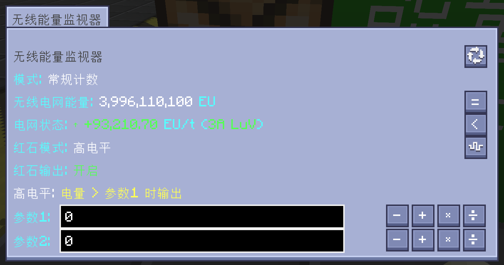
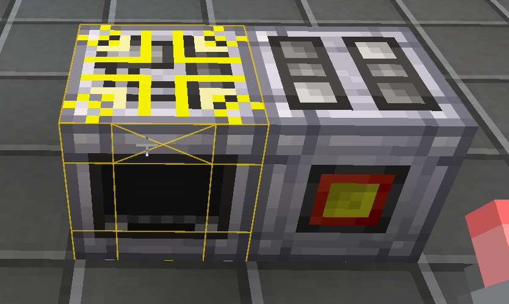
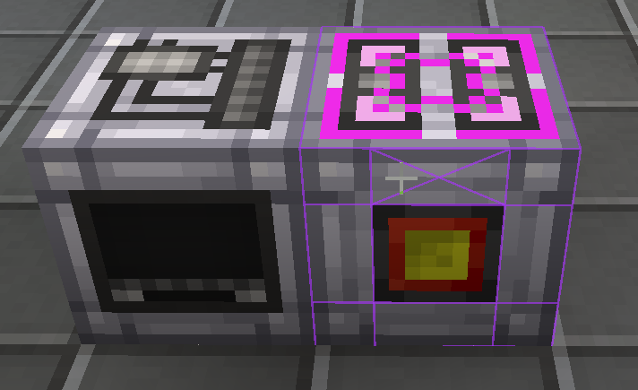

<h1 align="center">GT-Simple-Wireless-Network</h1>

<strong><em>GTNH Wireless Energy Network Mod</em></strong> <strong><em>GTNH 无线电网模组</em></strong>

A GregTech New Horizons mod that adds **wireless energy monitoring, transfer, and redstone control** to the GTNH wireless EU network. It provides portable and block-based monitors, wireless network link terminals, and link terminal covers (Energy/Power) — all craftable at LV tier — enabling intelligent grid analysis, redstone logic output, and seamless wireless energy transfer for any machine.

一个 GregTech New Horizons 模组，为 GTNH 无线 EU 网络添加**无线能量监控、传输和红石控制**。提供便携式和方块式监视器、无线网络链路终端和链路终端覆盖板（能源/动力）——全部可在 LV 阶段合成——实现智能电网分析、红石逻辑输出和任意机器的无线能量传输。

> \[!NOTE]
> This is an unofficial mod. Please avoid discussing this mod in official GTNH forums.
> 这是一个非官方模组，讨论此模组时请注意场合。

## Downloads & Requirements / 下载与版本需求

| GTNH         | GTSWN  | Maintenance / 维护 |
| ------------ | ------ | :--------------: |
| 2.9.0 beta-1 | 1.0.0+ |        ✔️        |
| 2.8.4        | 0.2.0  |        ❌️        |

***

## Wireless Energy Monitor / 无线能量监视器

  <em>无线能量监视器 / Wireless Energy Monitor</em>

**无线能量监视器 / Wireless Energy Monitor** — A single-block machine that displays real-time (per 5 seconds) wireless network energy status with advanced redstone control (can be measured by the wireless capacity or the wireless status.). Supports 5 redstone modes (Off/High/Low/High-Hysteresis/Low-Hysteresis) with parametric threshold settings. Dynamic texture switching reflects redstone output state. It can also be connected to the Industrial Information Panel.

无线能量监视器，单方块机器，实时显示无线电网能量状态 （每五秒），具备高级红石控制（可以以电网容量或者电网状态为指标）。支持5种红石模式（关闭/高电平/低电平/正向滞后/反向滞后），参数化阈值设定，状态贴图动态切换。其还可以连接工业信息屏。

- **Redstone Modes / 红石模式**: Off → High (signal when EU > threshold) → Low (signal when EU < threshold) → High-Hysteresis → Low-Hysteresis
- **Display Modes / 显示模式**: Normal counting (1,234,567 EU) / Scientific notation (1.235×10^6 EU)
- **Smart EU/t / 智能EU/t**: Real-time change rate with GT-style amperage + voltage tier display (e.g., "2A HV")

  <em>中文界面 (up) & English interface (down)</em>

***

## Portable Wireless Network Monitor / 便携无线监测终端

A handheld device that displays a HUD overlay when in inventory (including any Baubles accessory slot). Shows real-time wireless network energy, EU/t change rate, and GT-style power tier — all without placing any block. Works correctly on both single-player and dedicated servers via C→S→C network packet synchronization.

背包内（含任意 Baubles 饰品栏）自动显示 HUD 的手持设备。实时显示无线电网能量、EU/t 变化率和 GT 风格功率等级——无需放置任何方块。通过 C→S→C 网络包同步，在单人世界和专用服务器中均可正常使用。

- **Baubles Support / 支持饰品**: Can be placed in any Baubles accessory slot; HUD scans main hand → Baubles → inventory
- **Server Compatible / 服务器兼容**: Correctly displays EU on dedicated servers via client-request / server-response network synchronization

  <em>科学计数模式 — 充电状态 (left) & 放电状态 (right)</em>

***

## Network Info Panel & Extender / 网络信息屏与拓展屏

**Network Info Panel / 网络信息屏** — A multi-block display panel that visualizes wireless network energy trends over multiple time windows (5m/1h/8h/24h). Composed of a main panel and extender panels, it forms a contiguous screen of arbitrary rectangular size. Uses Catmull-Rom spline curves for smooth trend rendering and supports per-player data sharing across multiple screens.

网络信息屏，多方块显示面板，可视化无线电网能量趋势（5分钟/1小时/8小时/24小时多时间窗口）。由主屏和拓展屏组成，可拼接成任意矩形尺寸的连续屏幕。采用 Catmull-Rom 样条曲线平滑渲染趋势，支持多屏间按玩家 UUID 共享数据。

  <em>网络全天候检测示意图 / Network All-Weather Monitoring</em>

- **Multi-block Screen / 多方块屏幕**: Main panel + extender panels form a contiguous filled rectangle; extender screens automatically attach to adjacent main screens
- **4 Time Windows / 4 时间窗口**: 5-minute (real-time) / 1-hour / 8-hour / 24-hour datasets, with nested mean-value recording (1h←5m means, 8h←1h means, 24h←8h means)
- **Spline Curves / 样条曲线**: Fritsch-Carlson monotone cubic Hermite spline with configurable smoothing (0-12 → 4-26 segments)
- **Per-Player Sharing / 玩家共享**: Datasets bound to player UUID; multiple screens display the same data
- **Configurable Background / 可配置背景**: Customizable screen background color; clear to disable TESR fill
- **Display Modes / 显示模式**: Normal counting (1,234,567) / Scientific notation (1.23E6) / Metric notation (1.23K)

### AE Chart / AE 走势图

**AE Chart / AE 走势图** — Bind a specific item or fluid from the AE network to visualize its stock and change rate trends over time. Dual Y-axis display (left = stock blue, right = change rate orange), supports 4 time windows (5m/1h/8h/24h). Right-click the panel with an item/fluid in hand to bind. Brief area shows current stock, realtime change rate, and average change rate (first-last delta method over the 61-point window).

AE 走势图，绑定 AE 网络中的特定物品或流体，可视化其存量与变化率趋势。双 Y 轴显示（左=存量蓝、右=变化率橙），支持 4 时间窗口（5m/1h/8h/24h）。手持物品/流体右键信息屏即可绑定。简报区显示当前存量、实时变化速率、平均变化速率（基于 61 点首尾差值法）。

<!-- AE 走势图截图位置 / AE Chart screenshot placeholder -->

 <em>AE 走势图 / AE Chart</em>

- **Dual Y-Axis / 双 Y 轴**: Left axis = stock (blue), right axis = change rate (orange, consistent with wireless EU network EU/t line color)
- **Brief Area / 简报区**: Current stock + realtime change rate + average change rate (61-point first-last delta)
- **Configurable / 可配置**: Y-axis min/max, line thickness, spline smoothing, background color, line color, line visibility toggles

### AE Realtime Monitor / AE 实时监测

**AE Realtime Monitor / AE 实时监测** — Monitor multiple AE items/fluids simultaneously in a scrollable list. Each row shows icon, name, stock, realtime change rate, and 300s average change rate. Supports grid mode and configurable font size/bold/icon size. Right-click the panel with an item/fluid in hand to add a monitored item.

AE 实时监测，同时监控多个 AE 物品/流体，可滚动列表显示。每行包含图标、名称、存量、实时变化率、300s 平均变化率。支持格子模式与可配置字号/加粗/图标大小。手持物品/流体右键信息屏即可添加监视项。

<!-- AE 实时监测截图位置 / AE Realtime Monitor screenshot placeholder -->

 <em>AE 实时监测 / AE Realtime Monitor</em>

- **Scrollable List / 可滚动列表**: Custom GUI scroll list with mouse wheel, drag, and scrollbar support
- **Per-Item Data / 单项数据**: Icon + name + stock + realtime rate + 300s average rate (first-last delta)
- **Grid Mode / 格子模式**: Alternative compact grid layout with configurable cell size
- **Online Status / 在线状态**: Deep green text indicates the AE item is online and being monitored

***

## Redstone Control System / 红石控制系统

The Wireless Energy Monitor features a 5-mode redstone control system:

无线能量监视器具备5模式红石控制系统：

| Mode            | Behavior                                              |
| --------------- | ----------------------------------------------------- |
| Off             | No redstone output                                    |
| High            | Output signal when EU > threshold                     |
| Low             | Output signal when EU < threshold                     |
| High-Hysteresis | Output when EU > param1, cancel only when EU < param2 |
| Low-Hysteresis  | Output when EU < param2, cancel only when EU > param1 |

| 模式   | 行为                 |
| ---- | ------------------ |
| 关闭   | 不输出红石信号            |
| 高电平  | 电量 > 阈值时输出信号       |
| 低电平  | 电量 < 阈值时输出信号       |
| 正向滞后 | >参数1时输出，必须<参数2才能取消 |
| 反向滞后 | <参数2时输出，必须>参数1才能取消 |

***

## Network Status Calculation Mechanism / 电网状态计算机制

Both the **Wireless Energy Monitor** (block) and **Portable Wireless Network Monitor** (item) share a unified network status calculation mechanism (v1.3.0+). This section describes how EU/t change rate is computed and displayed.

**无线能量监视器**（方块）与**便携式无线网络监测终端**（物品）共享统一的电网状态计算机制（v1.3.0+）。本节说明 EU/t 变化率的计算与显示逻辑。

### Sampling & Window / 采样与窗口

- **Interval / 检测间隔**: 100 ticks (5 seconds) — synchronized for both MTE and HUD
- **Window / 窗口**: 300 seconds (61 samples: 1 initial + 60 interval checks)
- **Dataset / 数据集**: Fixed-capacity FIFO (`EUDataSet`, capacity=61). New samples push out the oldest, maintaining a rolling 300s window. BigDecimal precision division avoids double precision loss for large EU values.

### Two Logic Phases / 两类逻辑群

| Phase / 阶段 | Trigger / 触发条件 | Formula / 公式 |
| --- | --- | --- |
| Cold Start / 冷启动 | Dataset size < 61 (after reload/rejoin) | `(newest - oldest) / ((size-1) × 100t)` |
| Working / 工作态 | Dataset full (size == 61) | `(newest - oldest) / 6000t` (equivalent rolling window) |

Both formulas are mathematically equivalent: `(newest.value - oldest.value) / (newest.tick - oldest.tick)`.

### Special Status Display / 特殊状态显示

When the EU/t change rate is zero or near-zero, special labels are shown instead of numeric values:

| Condition / 条件 | Label / 标签 | Color / 颜色 |
| --- | --- | --- |
| `|eut| < 1` | `0 (<1EU)` | Gray / 灰 |
| `eut == 0` (all values identical) | `0 (Silent)` | Gray / 灰 |
| Silent ≥ 300s (long-term silent) | `0 (Long-Term Silent)` | Dark Gray / 深灰 |
| MTE reload delay (redstone buffer) | `Reload Calculating - Redstone Logic Maintained` | Red / 红 |
| HUD cold start (size < 2) | `网络状态：计算中... / Calculating...` | Cyan title + Orange value / 青+橙 |

### Long-Term Silent Mechanism / 长期静默机制

When the network stays silent (all sampled EU values identical) for ≥ 300s:
1. The status label switches from `Silent` to `Long-Term Silent`.
2. The dataset is compacted to only 2 data points (oldest + newest), saving memory.
3. On the next sample, if the value differs, **the last point is kept as the new dataset's starting point** (size=2, immediately calculable). If the value remains the same, only the newest sample's tick is updated.

当电网静默（所有采样值完全一致）持续 ≥ 300 秒时：
1. 状态标签从 `静默` 切换为 `长期静默`。
2. 数据集压缩为 2 个数据点（首末），节省内存。
3. 下次采样若数值不同，**保留末位点作为新数据集起点**（size=2，立即可计算 eut）。若数值仍相同，仅更新末位点的 tick。

This avoids unbounded dataset growth during idle periods while preserving accurate recovery when activity resumes.

### Reload & Rejoin Handling / 重载与重进处理

- **Short reload (≤10s)**: Dataset preserved, calculation resumes directly (≤3.3% slope error, acceptable).
- **Long reload (>10s)**: Dataset cleared, cold-start triggered. MTE enables a 30-second redstone buffer (`redstoneReloadDelay=600t`) to maintain redstone output while the dataset rebuilds.
- **Player rejoin (HUD)**: Dataset resets (portable devices don't persist data across sessions). Real-time gap detection (`System.currentTimeMillis()`, 10000ms threshold) handles logout detection since `getTotalWorldTime()` doesn't advance during logout.

***

## Wireless Energy Tap & Covers / 无线网络链路终端与覆盖板

 <em>链路终端与覆盖板 / Energy Tap and Covers</em>

### Wireless Energy Tap / 无线网络链路终端

A portable item that connects any machine to the wireless EU network. Shift+right-click to switch between Energy mode (draw from network, configurable loss, default 15%) and Power mode (output to network, virtual-cable drain via capacity buffer). Dynamic texture reflects current mode.

便携物品，将任意机器连接到无线 EU 网络。Shift+右键切换能源模式（从电网获取，可配置损耗，默认15%）和动力模式（向电网输出，通过电容量缓冲池像虚拟导线般取电）。动态纹理反映当前模式。

- **Grid Highlight / 九宫格辅助线**: When pointing at a GT machine (ICoverable), draws a 3×3 grid highlight matching GT wrench/cover tool behavior — Energy mode = yellow lines, Power mode = purple lines. / 指向 GT 机器（ICoverable）时，绘制与 GT 扳手/覆盖板工具一致的九宫格辅助线——能源模式=黄色线，动力模式=紫色线。

 <em>九宫格辅助线 / Grid Highlight</em>

### Link Terminal (Energy/Power) / 链路终端（能源/动力）

Both are **void covers** (虚空覆盖板) — they have no recipe and exist only as NBT-driven attachments placed by the Wireless Energy Tap. Their behavior is governed entirely by NBT parameters assigned on right-click; bare cover items without these parameters are inert. All NBT parameters persist across save/load.

两种覆盖板均为**虚空覆盖板**——无合成配方，仅作为由无线网络链路终端右击附着的 NBT 驱动覆盖板存在。其行为完全由右击赋予的 NBT 参数决定；裸覆盖板无参数时无效。所有 NBT 参数跨存档/退出持久化。

#### Link Terminal (Energy) / 链路终端（能源）

Acts as a **virtual power source** — maintains an internal capacity buffer and continuously injects EU into the bound machine like a real cable.

作为一个**虚拟电源**——内部维护电容量缓冲池，像导线一样持续向被绑定机器输入 EU。

- **Capacity / 电容量**: `V × A × 800` ticks (computed on configuration; immediately refilled to capacity)
- **Per-tick behavior / 每 tick 行为**: Injects `min(V × A, machine_needed, storedEU)` EU per tick into the bound machine — behaves like a real cable
- **Refill / 补满**: Every 600 ticks, deducts `(capacity − storedEU) × (1 + downlink loss)` EU from the wireless network to refill the buffer
- **Special case / 特例**: Single-block Arc Furnace is force-set to 4A (identified via recipe map `RecipeMaps.arcFurnaceRecipes`, not class name)
- **Unload / 卸载**: On cover removal, remaining buffer is returned to the network at `(1 − uplink loss)` rate

#### Link Terminal (Power) / 链路终端（动力）

Acts as a **virtual cable** — drains the machine's output into an internal buffer and uploads to the wireless network periodically. Capacity is fixed at `2^63 − 1` (GT5U MAX Battery).

作为一个**虚拟导线**——读取机器的输出存入内部缓冲池，并周期性上送到无线电网。电容量固定为 `2^63 − 1`。

- **Capacity / 电容量**: `Long.MAX_VALUE` (2^63 − 1)
- **Per-tick behavior / 每 tick 行为**: Reads `getOutputVoltage()` / `getOutputAmperage()` from the machine; if V > 0, drains `min(available, V × A)` EU into the buffer (respecting `getMinimumStoredEU()`). Non-output machines (V = 0) are skipped to avoid draining energy from machines that don't produce any.
- **Blocking / 阻断**: `letsEnergyOut() = false` blocks the machine from outputting to real cables on the cover's side, preventing double consumption
- **Upload / 上送**: Every 600 ticks, the buffer is uploaded to the wireless network at `(1 − uplink loss)` rate
- **Unload / 卸载**: On cover removal, remaining buffer is returned to the network at `(1 − uplink loss)` rate

***

## Admin Commands / 管理员命令

OP level 4 required. / 需要 OP 等级 4。

- **`/gtswn global_energy_trans <fromUUID> <toUUID>`** — One-time transfer of all EU from one UUID's network to another. Use when a player's UUID changes (e.g., premium → third-party account). / 一次性将 fromUUID 网络的所有 EU 迁移到 toUUID 网络。用于玩家换账户（正版转第三方等）导致 UUID 变化后迁移 EU。

- **`/gtswn global_energy_join <memberUUID> <leaderUUID>`** — Permanently join a player's network into another player's network via GT5U's team system (`SpaceProjectManager`). After joining, the member's wireless EU operations automatically resolve to the leader's network. / 通过 GT5U 团队系统将玩家的网络永久加入另一个玩家的网络。加入后，成员的无线 EU 操作自动解析到队长的网络。

***

## Tech Stack / 技术栈

- Java 25→8 (JVM Downgrader) / Minecraft 1.7.10 / Forge 10.13.4.1614
- Dependencies: GT5-Unofficial, GTNHLib, StructureLib, ModularUI, ModularUI2

## License / 许可证

See LICENSE file.
详见 LICENSE 文件。
