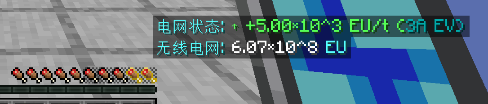
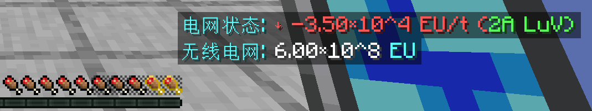
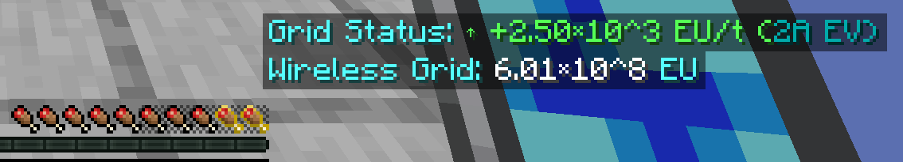

模组说明  Mod Description
=====================

| 说明 | Description |
| --- | --- |
该工程目前处于基础架构验证阶段，已完成测试用多方块机器 (MTEMultiTestMachine) 的开发与专属配方系统集成。适配版本 GTNH 2.8.x。 | This project is currently in the infrastructure verification stage. Development of the test multiblock machine (MTEMultiTestMachine) and integration of the exclusive recipe system have been completed. Target compatibility: GTNH 2.8.x. |

## 功能介绍  Features

| 功能 | Feature |
| --- | --- |
| **便携无线监测终端** • 背包内自动显示 HUD • 三种显示模式：关闭/常规计数/科学计数 • 实时显示电网状态和 EU/t 变化率 • GT 风格电流+电压等级显示（15 级色阶） • 智能 dEU/dt 计算   *科学计数模式 - 电网充电状态*   *科学计数模式 - 电网放电状态* | **Portable Wireless Network Monitor** • Automatic HUD display when in inventory • Three display modes: Off/Normal/Scientific • Real-time grid status and EU/t change rate • GT-style amperage + voltage tier display (15-level color gradient) • Smart dEU/dt calculation   *Scientific mode - Grid charging status*   *Scientific mode - Grid discharging status* |

|       | 更新日志                                              | Update log                                                                                                    |
|-------|---------------------------------------------------|---------------------------------------------------------------------------------------------------------------|
| 0.1.0 | • 代码结构优化 • 添加便携无线监测终端 |• Code structure optimization • Added portable wireless network monitor|
| 0.0.5 | • 添加 TestCoinE，消耗电量获取测试机器 • 实现物品电量管理和操作功能 | • Added TestCoinE, consume electricity to obtain test machines • Implemented item electricity management and operation|
| 0.0.4 | • 添加 MTEMultiTestMachine • 添加 TestCoin • 添加新机器类型及配方 • 添加 NEI 适配 | • Added MTEMultiTestMachine • Added TestCoin • Added new machine type and recipes • Added NEI support|
| 0.0.3 | • 清理冗余配置项，精简项目结构 | • Removed redundant configurations and streamlined project structure|
| 0.0.2 | 架构重构与功能完善 • 添加创造模式物品栏支持 • 采用 GregTech 队列注册方式，实现集中注册 • 批量导入自定义材质系统 • 清理冗余配置，优化项目结构 | Architecture Refactoring & Feature Enhancement • Added creative mode tab support • Adopted GregTech queue registration for centralized machine registration • Implemented batch custom texture import system • Cleaned up redundant configurations and optimized project structure |
| 0.0.1 | • 添加 MTETestMachine 作为测试机器 | • Add MTETestMachine as the testing machine |

---

## 致谢  Acknowledgements

感谢 **通义灵码（Tongyi Lingma）** 在本项目开发过程中提供的智能代码辅助和技术支持。

Special thanks to **Tongyi Lingma** for providing intelligent code assistance and technical support during the development of this project.

