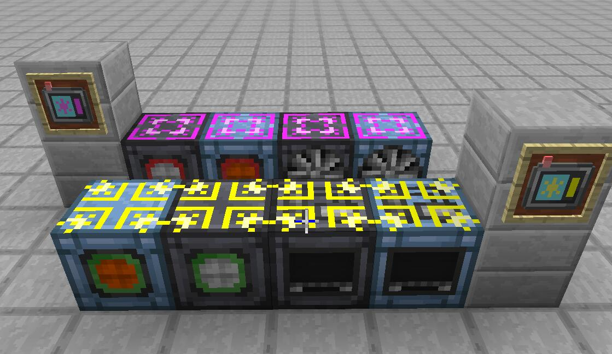
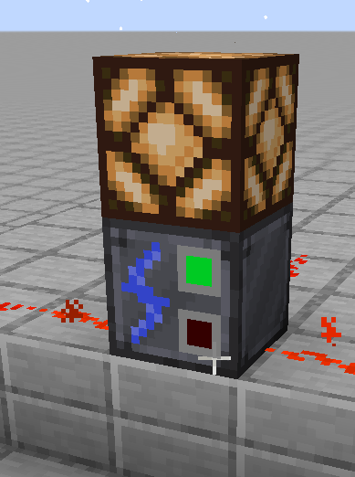
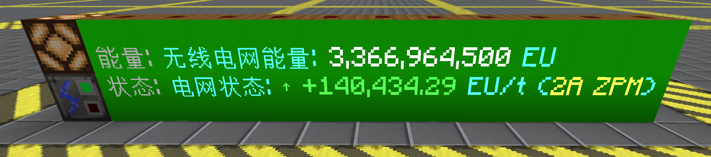
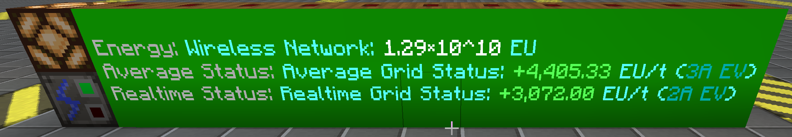

模组说明  Mod Description
=====================

| 说明 | Description |
| --- | --- |
| 添加了便携与机器版的无线监测终端、无线网络链路终端与无线能量覆盖板，均可在LV阶段合成，具有电网智能记录分析与红石逻辑信号输出功能，可智能配置任意机器接入无线网络，实现无线能量传输。  为了平衡，链路节点从无线EU网络获取能量时，会造成15%的额外损耗。 | Added portable and machine versions of wireless network monitors, wireless energy tap terminal and wireless energy covers, all craftable at LV tier, featuring intelligent grid analysis and redstone logic signal output, and smart wireless energy transfer by connecting any machine to wireless network. Target compatibility: GTNH 2.8.x.  For balance, Energy Tap will cause 15% extra loss when drawing energy from wireless EU network. |

## 功能介绍  Features

| 功能 | Feature                                                                                                                                                                                                                                                                                                                                                                                                                                                                                                                                                                    |
| --- |----------------------------------------------------------------------------------------------------------------------------------------------------------------------------------------------------------------------------------------------------------------------------------------------------------------------------------------------------------------------------------------------------------------------------------------------------------------------------------------------------------------------------------------------------------------------------|
| **无线网络链路终端** • 通过向能量容器添加“链路节点”实现同无线网络的连接 • Shift+右键切换能源/动力模式 • 能源模式：从电网获取能量（扣除15%损耗） • 动力模式：向电网输出能量（无损耗） • 两种模式均有动态纹理   *链路终端与覆盖板* | **Wireless Energy Tap** • Connect machines to wireless network by attaching "Energy Tap" • Shift+Right-click to switch Energy/Power modes • Energy mode: Draw from network (15% loss) • Power mode: Output to network (no loss) • Dynamic textures for both modes   *Wireless Energy Tap and Covers* |
| **便携无线监测终端** • 背包内自动显示 HUD • 三种显示模式：关闭/常规计数/科学计数 • 实时显示电网状态和 EU/t 变化率 • GT 风格电流+电压等级显示 • 智能 dEU/dt 计算   *科学计数模式 - 电网充电状态*   *科学计数模式 - 电网放电状态* | **Portable Wireless Network Monitor** • Automatic HUD display when in inventory • Three display modes: Off/Normal/Scientific • Real-time network status and EU/t change rate • GT-style amperage + voltage tier display  • Smart dEU/dt calculation   *Scientific mode - Network charging status*   *Scientific mode - Network discharging status* |
| **无线能量监视器** • 实时监控无线电网能量状态 • 红石信号输出控制（高电平/低电平/滞后模式） • 参数化阈值设定 • 状态贴图动态切换   *机器外观*   *中文界面* | **Wireless Energy Monitor** • Real-time wireless network energy monitoring • Redstone signal output control (High/Low/Hysteresis modes) • Parametric threshold settings • Dynamic status texture switching   *Machine appearance*   *English interface* |

|       | 更新日志                                              | Update log                                                                                                    |
|-------|---------------------------------------------------|---------------------------------------------------------------------------------------------------------------|
| **0.2.0** *(Main)* | • 添加无线网络链路终端 • 添加无线能量覆盖板（能源/动力模式） • 添加覆盖板配方 • 添加电网损耗（能源模式扣除15%） • 修复覆盖板材质显示问题 • 完善翻译支持 • 优化能量传输间隔计算 | • Added Wireless Energy Tap • Added Wireless Energy Covers (Energy/Power modes) • Added cover recipes • Added network loss (15% deducted in Energy mode) • Fixed cover texture display issues • Improved translation support • Optimized energy transfer interval calculation |
| **0.1.2** *(Fix)* | • 添加 MTEMonitor 基类 • 修复跨存档缓存遗留 • 修复 HUD 默认开启问题 |• Added MTEMonitor base class • Fixed cross-save cache persistence • Fixed HUD default enabled issue|
| **0.1.1** *(Main)* | • 添加无线能量监视器 • 红石控制功能（高/低/滞后模式） • 状态贴图动态切换 • 参数退位优化 • 优化便携无线监测终端显示 |• Added Wireless Energy Monitor • Redstone control (High/Low/Hysteresis) • Dynamic status textures • Parameter decrement optimization • Optimized portable wireless monitor display|
| **0.1.0** *(Main)* | • 代码结构优化 • 添加便携无线监测终端 |• Code structure optimization • Added portable wireless network monitor|
| 0.0.5 | • 添加 TestCoinE，消耗电量获取测试机器 • 实现物品电量管理和操作功能 | • Added TestCoinE, consume electricity to obtain test machines • Implemented item electricity management and operation|
| 0.0.4 | • 添加 MTEMultiTestMachine • 添加 TestCoin • 添加新机器类型及配方 • 添加 NEI 适配 | • Added MTEMultiTestMachine • Added TestCoin • Added new machine type and recipes • Added NEI support|
| 0.0.3 | • 清理冗余配置项，精简项目结构 | • Removed redundant configurations and streamlined project structure|
| 0.0.2 | 架构重构与功能完善 • 添加创造模式物品栏支持 • 采用 GregTech 队列注册方式，实现集中注册 • 批量导入自定义材质系统 • 清理冗余配置，优化项目结构 | Architecture Refactoring & Feature Enhancement • Added creative mode tab support • Adopted GregTech queue registration for centralized machine registration • Implemented batch custom texture import system • Cleaned up redundant configurations and optimized project structure |
| 0.0.1 | • 添加 MTETestMachine 作为测试机器 | • Add MTETestMachine as the testing machine |

