<h1 align="center">GT-Simple-Wireless-Network</h1>

<strong><em>GTNH 无线电网模组</em></strong> <strong><em>GTNH Wireless Energy Network Mod</em></strong>

  
  
  
  
  

一个 GregTech New Horizons 模组，为 GTNH 无线 EU 网络添加**无线能量监控、传输和红石控制**。提供便携式和方块式监视器、无线网络链路终端和链路终端覆盖板（能源/动力）——全部可在 LV 阶段合成——实现智能电网分析、红石逻辑输出和任意机器的无线能量传输。

A GregTech New Horizons mod that adds **wireless energy monitoring, transfer, and redstone control** to the GTNH wireless EU network. It provides portable and block-based monitors, wireless network link terminals, and link terminal covers (Energy/Power) — all craftable at LV tier — enabling intelligent grid analysis, redstone logic output, and seamless wireless energy transfer for any machine.

> \[!NOTE]
> 这是一个非官方模组，讨论此模组时请注意场合。
> This is an unofficial mod. Please avoid discussing this mod in official GTNH forums.

> 📖 **完整文档请查阅 [Wiki](https://github.com/MIAOKATZE/GT-Simple-Wireless-Network/wiki) / For full documentation, see the [Wiki](https://github.com/MIAOKATZE/GT-Simple-Wireless-Network/wiki)**

## 下载与版本需求 / Downloads & Requirements

| GTNH         | GTSWN  | 维护 / Maintenance |
| ------------ | ------ | :--------------: |
| 2.9.0 beta-1&2&3 | **1.8.0 +**（当前 / current） |        ✔️        |
| 2.9.0 beta-1&2 | 1.0.0~1.7.25| ✔️ |
| 2.8.4        | 0.2.0  |        ❌️        |

当前版本 / Current release：**1.8.3** — 下载 / Downloads：[GitHub Releases](https://github.com/MIAOKATZE/GT-Simple-Wireless-Network/releases)

***

## 无线能量监视器 / Wireless Energy Monitor

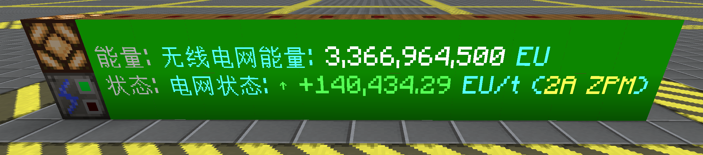 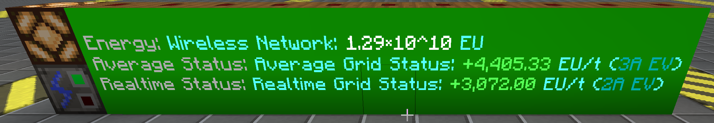 <em>无线能量监视器 / Wireless Energy Monitor</em>

**无线能量监视器 / Wireless Energy Monitor** — 单方块机器，实时显示无线电网能量状态（每五秒），具备高级红石控制（可以以电网容量或者电网状态为指标）。支持5种红石模式（关闭/高电平/低电平/正向滞后/反向滞后），参数化阈值设定，状态贴图动态切换。其还可以连接工业信息屏。

A single-block machine that displays real-time (per 5 seconds) wireless network energy status with advanced redstone control (can be measured by the wireless capacity or the wireless status). Supports 5 redstone modes (Off/High/Low/High-Hysteresis/Low-Hysteresis) with parametric threshold settings. Dynamic texture switching reflects redstone output state. It can also be connected to the Industrial Information Panel.

- **显示模式 / Display Modes**: 常规计数 / 科学计数（Normal counting (1,234,567 EU) / Scientific notation (1.235×10^6 EU)）
- **智能 EU/t / Smart EU/t**: 实时变化率，GT 风格安培数 + 电压等级显示（如 "2A HV"）/ Real-time change rate with GT-style amperage + voltage tier display (e.g., "2A HV")

 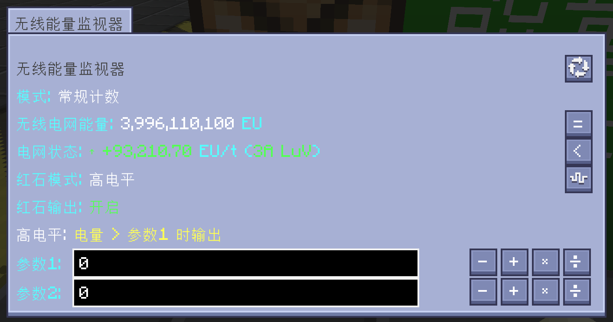 <em>中文界面 (up) & English interface (down)</em>

***

## 便携无线监测终端 / Portable Wireless Network Monitor

背包内（含任意 Baubles 饰品栏）自动显示 HUD 的手持设备。实时显示无线电网能量、EU/t 变化率和 GT 风格功率等级——无需放置任何方块。通过 C→S→C 网络包同步，在单人世界和专用服务器中均可正常使用。

A handheld device that displays a HUD overlay when in inventory (including any Baubles accessory slot). Shows real-time wireless network energy, EU/t change rate, and GT-style power tier — all without placing any block. Works correctly on both single-player and dedicated servers via C→S→C network packet synchronization.

- **饰品支持 / Baubles Support**: 可放入任意 Baubles 饰品栏；HUD 扫描顺序：主手 → Baubles → 背包 / Can be placed in any Baubles accessory slot; HUD scans main hand → Baubles → inventory
- **服务器兼容 / Server Compatible**: 通过客户端请求 / 服务端响应的网络同步，在专用服务器上正确显示 EU / Correctly displays EU on dedicated servers via client-request / server-response network synchronization

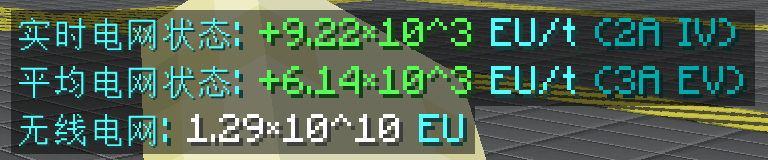 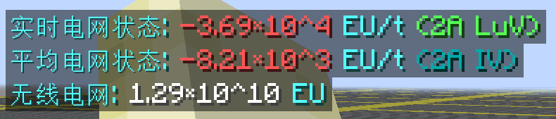 <em>科学计数模式 — 充电状态 (left) & 放电状态 (right)</em>

***

## 网络信息屏与拓展屏 / Network Info Panel & Extender

网络信息屏，多方块显示面板，可视化无线电网能量趋势（8 个嵌套时间窗口：5 分钟 / 1 小时 / 8 小时 / 24 小时 / 7 天 / 1 月 / 3 月 / 1 年）。由主屏和拓展屏组成，可拼接成任意矩形尺寸的连续屏幕。采用 Fritsch-Carlson 单调三次 Hermite 样条曲线平滑渲染趋势，支持多屏间按玩家 UUID 共享数据。

**Network Info Panel** — A multi-block display panel that visualizes wireless network energy trends over 8 nested time windows (5m/1h/8h/24h/7d/1M/3M/1Y). Composed of a main panel and extender panels, it forms a contiguous screen of arbitrary rectangular size. Uses Fritsch-Carlson monotone cubic Hermite spline curves for smooth trend rendering and supports per-player data sharing across multiple screens.

  <em>网络全天候检测示意图 / Network All-Weather Monitoring</em>

- **多方块屏幕 / Multi-block Screen**: 主屏 + 拓展屏构成连续填充矩形；拓展屏自动附着到相邻主屏 / Main panel + extender panels form a contiguous filled rectangle; extender screens automatically attach to adjacent main screens
- **8 时间窗口 / 8 Time Windows**: 5m / 1h / 8h / 24h / 7d / 1M(28d) / 3M(84d) / 1Y(336d) 数据集，各 61 点 FIFO，**自然比例**均值流入链（12→8→3→7→4→3→4）；窗口写满后自动淘汰最旧数据，无需手动清理 / 5m / 1h / 8h / 24h / 7d / 1M(28d) / 3M(84d) / 1Y(336d) datasets, each 61-point FIFO with **natural-ratio** mean-value inflow chain (12→8→3→7→4→3→4); windows fill up and drop oldest automatically, no manual cleanup needed
- **请求驱动采样 / Request-Driven Sampling**: v1.5.17 起，信息屏每 tick 通过 `updateRequestTick` 通知数据集"我在线"，调度器只对 5 分钟内有请求的数据集采样；超时自动停止采样，无需安全网清理 / Since v1.5.17, the panel notifies datasets via `updateRequestTick` every tick ("I'm online"), and the scheduler only samples datasets requested within the last 5 minutes; sampling stops automatically on timeout, no safety-net cleanup needed
- **样条曲线 / Spline Curves**: Fritsch-Carlson 单调三次 Hermite 样条，平滑度可配置（0-12 → 4-26 段）/ Fritsch-Carlson monotone cubic Hermite spline with configurable smoothing (0-12 → 4-26 segments)
- **玩家共享 / Per-Player Sharing**: 数据集绑定玩家 UUID；多块屏幕显示同一数据 / Datasets bound to player UUID; multiple screens display the same data
- **可配置背景 / Configurable Background**: 屏幕背景色可自定义；清除后禁用 TESR 填充 / Customizable screen background color; clear to disable TESR fill
- **显示模式 / Display Modes**: 常规计数 (1,234,567) / 科学计数 (1.23E6) / 公制计数 (1.23K)，**默认科学计数** / Normal counting (1,234,567) / Scientific notation (1.23E6) / Metric notation (1.23K), **scientific by default**

### AE 走势图 / AE Chart

AE 走势图，绑定 AE 网络中的特定物品或流体，可视化其存量与变化率趋势。双 Y 轴显示（左=存量蓝、右=变化率橙），支持 8 时间窗口（5m/1h/8h/24h/7d/1M/3M/1Y），与 EU 走势图共用相同的自然比例流入链。手持物品/流体右键信息屏即可绑定。简报区**居中显示且可缩放**（复用 `briefRatio`），显示当前存量、实时变化速率、平均变化速率（基于 61 点首尾差值法）。

**AE Chart** — Bind a specific item or fluid from the AE network to visualize its stock and change rate trends over time. Dual Y-axis display (left = stock blue, right = change rate orange), supports 8 time windows (5m/1h/8h/24h/7d/1M/3M/1Y) sharing the same natural-ratio inflow chain as the EU Chart. Right-click the panel with an item/fluid in hand to bind. Brief area is **centered & scalable** (reusing `briefRatio`), showing current stock, realtime change rate, and average change rate (first-last delta method over the 61-point window).

 <em>AE 走势图 / AE Chart</em>

- **双 Y 轴 / Dual Y-Axis**: 左轴 = 存量（蓝），右轴 = 变化率（橙，与无线电网 EU/t 线颜色一致）/ Left axis = stock (blue), right axis = change rate (orange, consistent with wireless EU network EU/t line color)
- **居中简报 / Centered Brief**: v1.5.17 起简报文字居中绘制，GUI 的 `+/-` 按钮复用 `briefRatio` 控制字号（与 EU 走势图一致），点击时长标签按钮切换 8 时间窗口 / Since v1.5.17, brief text is drawn centered; the GUI `+/-` buttons reuse `briefRatio` for font size (same as the EU chart), and clicking the time-span label cycles the 8 time windows
- **简报区 / Brief Area**: 当前存量 + 实时变化率 + 平均变化率（61 点首尾差值）/ Current stock + realtime change rate + average change rate (61-point first-last delta)
- **可配置 / Configurable**: Y 轴上下限、线宽、样条平滑度、背景色、线色、线条可见性开关 / Y-axis min/max, line thickness, spline smoothing, background color, line color, line visibility toggles

### AE 实时监测 / AE Realtime Monitor

AE 实时监测，同时监控多个 AE 物品/流体，可滚动列表显示。每行包含图标、名称、存量、实时变化率、300s 平均变化率。支持格子模式与可配置字号/加粗/图标大小。手持物品/流体右键信息屏即可添加监视项。

**AE Realtime Monitor** — Monitor multiple AE items/fluids simultaneously in a scrollable list. Each row shows icon, name, stock, realtime change rate, and 300s average change rate. Supports grid mode and configurable font size/bold/icon size. Right-click the panel with an item/fluid in hand to add a monitored item.

 <em>AE 实时监测 / AE Realtime Monitor</em>

- **可滚动列表 / Scrollable List**: 自定义 GUI 滚动列表，支持滚轮、拖拽与滚动条 / Custom GUI scroll list with mouse wheel, drag, and scrollbar support
- **单项数据 / Per-Item Data**: 图标 + 名称 + 存量 + 实时变化率 + 300s 平均变化率（首尾差值）/ Icon + name + stock + realtime rate + 300s average rate (first-last delta)
- **格子模式 / Grid Mode**: 紧凑格子布局备选，单元格大小可配置 / Alternative compact grid layout with configurable cell size
- **在线状态 / Online Status**: 深绿色文字表示该 AE 物品在线并被监视 / Deep green text indicates the AE item is online and being monitored

***

## 红石控制系统 / Redstone Control System

无线能量监视器具备5模式红石控制系统：

The Wireless Energy Monitor features a 5-mode redstone control system:

| 模式   | 行为                 |
| ---- | ------------------ |
| 关闭   | 不输出红石信号            |
| 高电平  | 电量 > 阈值时输出信号       |
| 低电平  | 电量 < 阈值时输出信号       |
| 正向滞后 | >参数1时输出，必须<参数2才能取消 |
| 反向滞后 | <参数2时输出，必须>参数1才能取消 |

| Mode            | Behavior                                              |
| --------------- | ----------------------------------------------------- |
| Off             | No redstone output                                    |
| High            | Output signal when EU > threshold                     |
| Low             | Output signal when EU < threshold                     |
| High-Hysteresis | Output when EU > param1, cancel only when EU < param2 |
| Low-Hysteresis  | Output when EU < param2, cancel only when EU > param1 |

***

## 电网状态计算机制 / Network Status Calculation Mechanism

**无线能量监视器**（方块）与**便携式无线网络监测终端**（物品）共享统一的电网状态计算机制。EU/t 基于 300 秒滚动窗口（61 点 FIFO，100t 采样间隔，BigDecimal 精确计算）的首末两点斜率计算。近零速率有特殊标签（`<1EU`、`静默`、`长期静默`），重载处理在冷启动重建期间维持红石输出。详见 [Wiki](https://github.com/MIAOKATZE/GT-Simple-Wireless-Network/wiki)。

Both the **Wireless Energy Monitor** (block) and **Portable Wireless Network Monitor** (item) share a unified network status calculation mechanism. EU/t is computed via first-last slope over a 300s rolling window (61-point FIFO, 100t sampling interval, BigDecimal precision). Special labels are shown for near-zero rates (`<1EU`, `Silent`, `Long-Term Silent`), and reload handling preserves redstone output during cold-start rebuilds. See the [Wiki](https://github.com/MIAOKATZE/GT-Simple-Wireless-Network/wiki) for full details.

***

## 无线网络链路终端与覆盖板 / Wireless Energy Tap & Covers

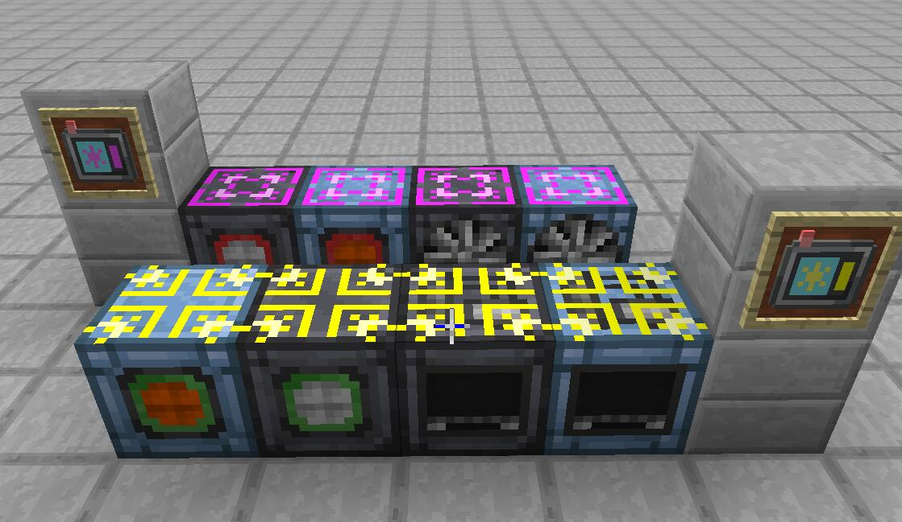 <em>链路终端与覆盖板 / Energy Tap and Covers</em>

### 无线网络链路终端 / Wireless Energy Tap

便携物品，将任意机器连接到无线 EU 网络。Shift+右键切换能源模式（从电网获取，可配置损耗，默认15%）和动力模式（向电网输出，通过电容量缓冲池像虚拟导线般取电）。动态纹理反映当前模式。绑定激光源仓/靶仓时需消耗 1 根激光真空管。

A portable item that connects any machine to the wireless EU network. Shift+right-click to switch between Energy mode (draw from network, configurable loss, default 15%) and Power mode (output to network, virtual-cable drain via capacity buffer). Dynamic texture reflects current mode. Binding a Laser Source/Target Hatch consumes 1 Laser Vacuum Pipe.

- **显形扫描反馈 / Reveal Scan Feedback**: 显形扫描完成后会在聊天框提示显现的节点数量；未发现节点时提示“未发现”。/ After a reveal scan completes, the chat reports the number of nodes revealed; if none are found, it reports “none found”.
- **九宫格辅助线 / Grid Highlight**: 指向 GT 机器（ICoverable）时，绘制与 GT 扳手/覆盖板工具一致的九宫格辅助线——能源模式=黄色线，动力模式=紫色线。/ When pointing at a GT machine (ICoverable), draws a 3×3 grid highlight matching GT wrench/cover tool behavior — Energy mode = yellow lines, Power mode = purple lines.

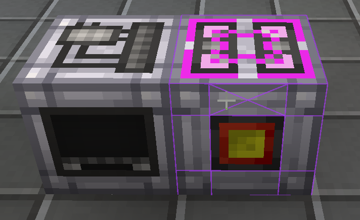 <em>九宫格辅助线 / Grid Highlight</em>

### 链路终端（能源/动力） / Link Terminal (Energy/Power)

两种覆盖板均为**虚空覆盖板**——无合成配方，仅作为由无线网络链路终端右击附着的 NBT 驱动覆盖板存在。其行为完全由右击赋予的 NBT 参数决定；裸覆盖板无参数时无效。所有 NBT 参数跨存档/退出持久化。

Both are **void covers** — they have no recipe and exist only as NBT-driven attachments placed by the Wireless Energy Tap. Their behavior is governed entirely by NBT parameters assigned on right-click; bare cover items without these parameters are inert. All NBT parameters persist across save/load.

#### 链路终端（能源） / Link Terminal (Energy)

作为一个**虚拟电源**——内部维护电容量缓冲池，像导线一样持续向被绑定机器输入 EU。

Acts as a **virtual power source** — maintains an internal capacity buffer and continuously injects EU into the bound machine like a real cable.

- **电容量 / Capacity**: `V × A × 800` ticks（配置时计算；立即补满至容量）/ `V × A × 800` ticks (computed on configuration; immediately refilled to capacity)
- **每 tick 行为 / Per-tick behavior**: 每 tick 向被绑定机器注入 `min(V × A, machine_needed, storedEU)` EU——表现得像真实导线 / Injects `min(V × A, machine_needed, storedEU)` EU per tick into the bound machine — behaves like a real cable
- **补满 / Refill**: 每 600 ticks 从无线电网扣除 `(capacity − storedEU) × (1 + downlink loss)` EU 补满缓冲池 / Every 600 ticks, deducts `(capacity − storedEU) × (1 + downlink loss)` EU from the wireless network to refill the buffer
- **特例 / Special case**: 单方块电弧炉强制设为 4A（经配方表 `RecipeMaps.arcFurnaceRecipes` 识别，而非类名）/ Single-block Arc Furnace is force-set to 4A (identified via recipe map `RecipeMaps.arcFurnaceRecipes`, not class name)
- **卸载 / Unload**: 覆盖板移除时，剩余缓冲按 `(1 − uplink loss)` 比率返还电网 / On cover removal, remaining buffer is returned to the network at `(1 − uplink loss)` rate

#### 链路终端（动力） / Link Terminal (Power)

作为一个**虚拟导线**——读取机器的输出存入内部缓冲池，并周期性上送到无线电网。电容量固定为 `2^63 − 1`。

Acts as a **virtual cable** — drains the machine's output into an internal buffer and uploads to the wireless network periodically. Capacity is fixed at `2^63 − 1` (GT5U MAX Battery).

- **电容量 / Capacity**: `Long.MAX_VALUE`（2^63 − 1）/ `Long.MAX_VALUE` (2^63 − 1)
- **每 tick 行为 / Per-tick behavior**: 读取机器的 `getOutputVoltage()` / `getOutputAmperage()`；若 V > 0，取 `min(available, V × A)` EU 入缓冲池（尊重 `getMinimumStoredEU()`）。非输出机器（V = 0）跳过，避免抽干不产电的机器 / Reads `getOutputVoltage()` / `getOutputAmperage()` from the machine; if V > 0, drains `min(available, V × A)` EU into the buffer (respecting `getMinimumStoredEU()`). Non-output machines (V = 0) are skipped to avoid draining energy from machines that don't produce any.
- **阻断 / Blocking**: `letsEnergyOut() = false` 阻止机器从覆盖板所在侧面输出到真实导线，防止双重消耗 / `letsEnergyOut() = false` blocks the machine from outputting to real cables on the cover's side, preventing double consumption
- **上送 / Upload**: 每 600 ticks 将缓冲池按 `(1 − uplink loss)` 比率上送无线电网 / Every 600 ticks, the buffer is uploaded to the wireless network at `(1 − uplink loss)` rate
- **卸载 / Unload**: 覆盖板移除时，剩余缓冲按 `(1 − uplink loss)` 比率返还电网 / On cover removal, remaining buffer is returned to the network at `(1 − uplink loss)` rate

***

## ME 网络量子终端与节点 / ME Network Quantum Terminal & Node

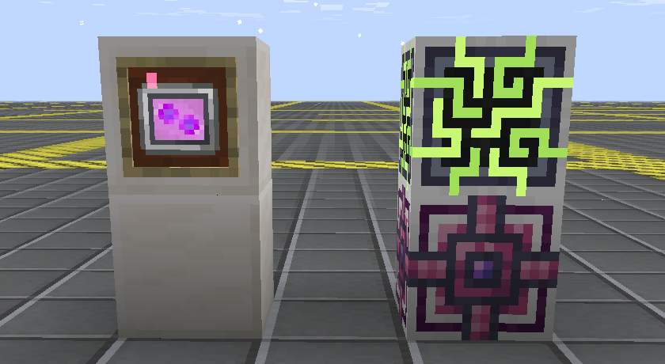  <em>ME 网络量子终端（左）与量子节点（右）/ ME Network Quantum Terminal (left) & Quantum Node (right)</em>

为 AE2 网络提供「量子化」远程接入机制。量子终端将成型的 ME 控制器整结构量子化并绑定其网络；量子节点作为远程接入点，经虚拟桥接接入锚点控制器网络——突破原版线缆距离限制，相邻 AE2 设备直接入网。

Adds a "quantum" remote-access mechanism to AE2 networks. The Quantum Terminal quantizes a formed ME controller structure and binds its network; the Quantum Node acts as a remote access point that bridges into the anchored controller's grid via a virtual GridConnection — bypassing vanilla cable distance limits so adjacent AE2 devices join directly.

量子终端可通过 LV 级工作台配方合成（福鲁伊克斯方块 ×4 + LV 发射器 ×4 + ME 控制器 ×1）；量子节点无独立配方——已绑定终端右击空地放置，Shift+右击销毁（无掉落）。

Quantum Terminal is craftable via an LV-tier crafting recipe (Fluix ×4 + LV Emitter ×4 + ME Controller ×1); the Quantum Node has no recipe — place it with a bound terminal by right-clicking ground, and destroy it with shift+right-click (no drops).

### 量子终端 / Quantum Terminal

| 手势 / Gesture | 行为 / Behavior |
|---|---|
| 右击控制器 / Right-click controller | 量子化并绑定整结构（已量子化则改绑）/ Quantize & bind the entire structure (rebinds if already quantized) |
| Shift+右击控制器 / Shift+right-click controller | 取消量子化并解绑 / Dequantize & unbind |
| 右击空地（已绑定）/ Right-click ground (bound) | 放置量子节点 / Place a Quantum Node |
| Shift+右击节点 / Shift+right-click node | 销毁节点（无掉落）/ Destroy the node (no drops) |
| Shift+右击空气 / Shift+right-click air | 打开终端界面 / Open terminal GUI |

### 量子节点 / Quantum Node

- **远程桥接 / Remote Bridge**: 经虚拟桥接接入锚点控制器 ME 网络，相邻 AE2 设备直接入网。/ Bridges into the anchored controller's ME grid via a virtual connection; adjacent AE2 devices join the network directly.
- **无频道上限 / No Channel Limit**: 使用致密线缆容量（**32 频道/连接**），节点本身不消耗频道。/ Uses DENSE cable capacity (**32 channels/connection**); the node itself does not consume channels.
- **待机功耗 / Idle Power**: 通过 `quantumNodeIdlePowerUsage` 配置（默认 10.0 AE/t）。/ Configurable via `quantumNodeIdlePowerUsage` (default 10.0 AE/t).
- **单维度 / Single-Dimension**: v1 不支持跨维度桥接。/ v1 does not support cross-dimension bridging.

### 量子终端界面 / Quantum Terminal GUI

v1.6.9 起精简为紧凑布局（120×92），仅显示三类核心信息：

As of v1.6.9, the GUI is streamlined into a compact layout (120×92) showing only three core items:

| 项目 / Item | 说明 / Description |
|---|---|
| 控制器坐标 + 维度 / Controller Pos + Dim | 锚点坐标与维度 / Anchor coordinates and dimension |
| 量子节点数量 / Quantum Node Count | 网络中量子节点数量 / Number of Quantum Nodes in the network |
| 频道 / Channels | `已用 / 总数 (百分比%)`，过载时红色高亮 / `used / total (pct%)`, red highlight when overloaded |

### 过载保护 / Overload Protection

当量子节点带入的频道总数超过控制器结构容量（`(n×6 − sharedFaces) × 32`）时，整个控制器结构 **TNT 级爆炸**；达到 95% 阈值时向节点放置者发送聊天警告。

When the total channels brought in by Quantum Nodes exceed the controller structure capacity (`(n×6 − sharedFaces) × 32`), the entire structure **detonates in a TNT-level explosion**; a chat warning is sent to the node's placer at the 95% threshold.

### 量子化控制器强化 / Hardened Controller

量子化后的 ME 控制器获得等效硬度（挖掘速度降至 1/1000）与等效防爆（400000），且对爆炸事件自动移除受影响方块——防止被意外破坏或爆破。

Quantized ME controllers gain equivalent hardness (mining speed × 1/1000) and equivalent blast resistance (400000), and are automatically removed from explosion-affected block lists — preventing accidental breakage or blasting.

***

## 设备信息终端 / Device Info Terminal

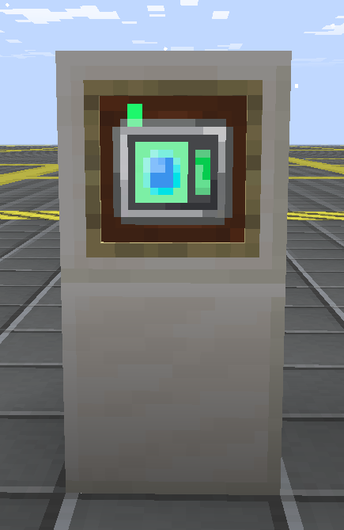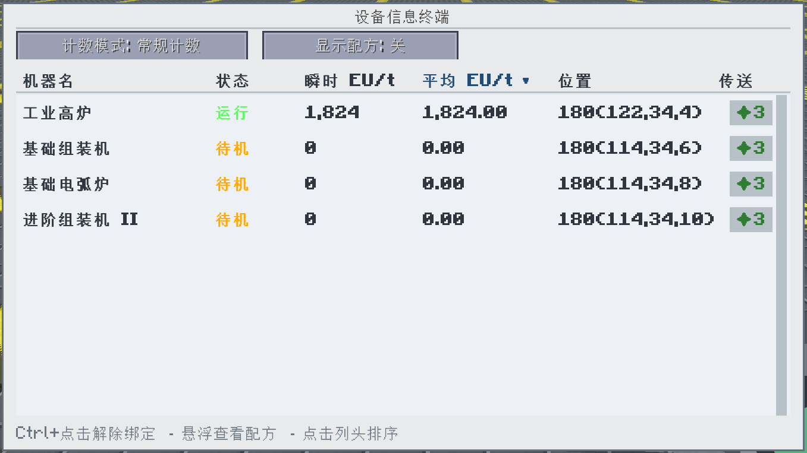 <em>设备信息终端物品（左）与界面（右） / Device Info Terminal item (left) & GUI (right)</em>

手持式 GT 机器监控终端（**已实装，持续迭代**）：绑定任意可工作 GT 机器（单方块/多方块），在滚动列表中实时查看三态（运行/待机/停机）、瞬时 EU/t、60 点平均 EU/t、位置与当前执行配方；支持五列排序（服务端 NBT 持久化）、**四种计数法（常规/科学计数/千位分隔/电压等级）**、行内经验传送与 Ctrl+点击远程解绑。

A handheld GT machine monitor (**implemented, under active iteration**): bind any working GT machine (single-block or multiblock) and review its tri-state (Running/Idle/Stopped), instant EU/t, 60-point average EU/t, position and current recipe in a scrolling list; five-column sorting (persisted to server NBT), **four notations (normal / scientific / thousands-separated / voltage tier)**, in-row XP-cost teleport and Ctrl+click remote unbind are supported.

| 手势 / Gesture | 行为 / Behavior |
|---|---|
| 右击可工作机器 / Right-click a working machine | 绑定到本终端（放置机器时背包含终端自动绑定 / auto-bound on placement if a terminal is in the placer's inventory） |
| 右击空气 / Right-click air | 打开终端界面 / Open the terminal GUI |
| Shift+右击（机器/空气均可）/ Shift+right-click (machine or air) | 全域扫描开关（20 秒倒计时可取消；团队 = GTNHLib Team 管理员/官员/成员并集）/ Team-wide scan toggle (20s countdown, cancellable; team = GTNHLib Team owners/officers/members) |
| Ctrl+点击条目 / Ctrl+click a row | 远程解绑（无确认）/ Remote unbind (no confirmation) |
| 点击行内 ✦ 按钮 / Click the ✦ button on a row | 传送到机器（消耗经验等级，3 秒冷却）/ Teleport to the machine (costs XP levels, 3s cooldown) |

- **采样与均值 / Sampling & Averages**: 每 `deviceSampleIntervalSeconds`（默认 10 秒）采样一次；平均列为 60 点滚动均值，瞬时 EU/t 取最新采样点。/ Machines are sampled every `deviceSampleIntervalSeconds` (default 10s); the average column is a 60-point rolling mean, instant EU/t is the latest sample.
- **配方悬浮 / Recipe Hover**: 行悬浮 ≥0.5 秒查看当前执行配方（输出快照，近似）；「显示配方」开关可临时用配方文本替换两列功率数值。/ Hover a row ≥0.5s to view the current recipe (output snapshot, approximate); the "Show recipe" toggle temporarily replaces the two power columns with the recipe text.
- **功率 provider / Authoritative Power Providers**: 对大型硅岩反应堆、戴森云等实时输出不写入标准功率字段的机器，读取其权威实时功率并区分消耗/产出；这类机器不写入标准词条。/ For machines such as the Large Naquadah Reactor and Dyson Swarm whose realtime output is not written to standard power fields, the terminal reads the authoritative realtime power and distinguishes consumption from generation instead of relying on standard entries.
- **发电识别覆盖 / Generation Recognition**: v1.8.2/1.8.3 起，发电识别覆盖内燃引擎家族（大型/极大型内燃引擎、柴油遗留机）、单方块发电机（含被无线动力覆盖板收割的场景，按名义输出显示）与权威 provider 机器，发电/耗电方向与数值均正确显示。/ Since v1.8.2/1.8.3, generation recognition covers the combustion engine family (Large/Extreme Combustion Engine, Diesel Engine legacies), single-block generators (including when harvested by a wireless Power cover, shown as nominal output), and authoritative-provider machines — generation/consumption direction and values are displayed correctly.
- **配置 / Configs**: `deviceSampleIntervalSeconds`（默认 10，最小 1）采样间隔；`deviceTeleportXPCost`（默认 3，最小 1）传送消耗经验等级；`deviceTerminalMaxMachines`（默认 1024，最小 16）单终端绑定上限。/ `deviceSampleIntervalSeconds` (default 10, min 1) sampling interval; `deviceTeleportXPCost` (default 3, min 1) teleport XP-level cost; `deviceTerminalMaxMachines` (default 1024, min 16) per-terminal binding cap.
- **合成 / Crafting**: LV 级有序配方（v1.7.8 起）：LV 传感器 ×2 + LV 发射器 ×2 + 钢板 ×3 + 电脑屏幕覆盖板 ×1 + 末影珍珠 ×1 → 设备信息终端 ×1。/ LV-tier shaped recipe (since v1.7.8): LV Sensor ×2 + LV Emitter ×2 + Steel Plate ×3 + Computer Screen Cover ×1 + Ender Pearl ×1 → Device Info Terminal ×1.

***

## BQ 任务包 / BetterQuesting Quest Pack

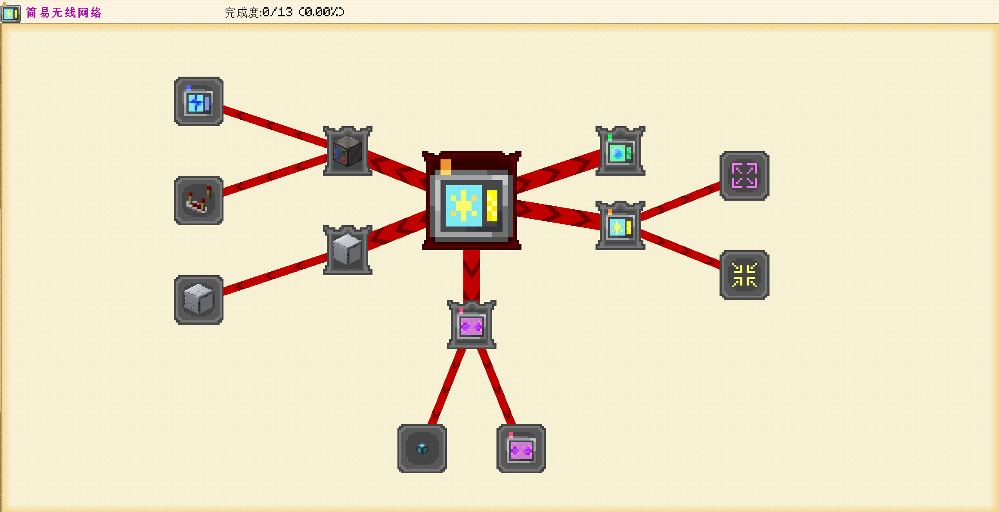 <em>「简易无线网络」任务线总览（13 题，红连线分支树） / "GT Simple Wireless Network" quest line (13 quests)</em>

随模组内置 **简易无线网络（GT Simple Wireless Network）** 任务线：13 个任务从无线能量监视器与掌上 HUD 讲起，经链路终端与无线覆盖板、墙面信息屏，一直到 ME 网络量子化与设备信息终端——全部为 LV 时代科技。任务线与各任务的名称、描述均内置中英双语本地化。

A BetterQuesting quest pack ships inside the mod: the **GT Simple Wireless Network (简易无线网络)** quest line of 13 quests — from the Wireless Energy Monitor and pocket HUD through the Link Terminal and its covers and wall-sized info panels, ending with ME network quantization and the Device Info Terminal. Everything is LV-era tech. Quest line and per-quest names/descriptions are localized in both Chinese and English.

- **自动装载 / Auto Deployment**: 新世界由注入器按任务行 UUID 幂等装载；老世界进档（serverStarting）时按版本戳自动对齐最新定义，进度保留；已从清单移除的任务自动剪枝。/ The injector idempotently loads the pack into new worlds by quest-line UUID; existing worlds auto-align to the latest definitions on server start via the version stamp, keeping progress, and removed quests are pruned automatically.

***

## 管理员命令 / Admin Commands

需要 OP 等级 4。/ OP level 4 required.

- **`/gtswn global_energy_trans <fromUUID> <toUUID>`** — 一次性将 fromUUID 网络的所有 EU 迁移到 toUUID 网络。用于玩家换账户（正版转第三方等）导致 UUID 变化后迁移 EU。/ One-time transfer of all EU from one UUID's network to another. Use when a player's UUID changes (e.g., premium → third-party account).

- **`/gtswn global_energy_join <memberUUID> <leaderUUID>`** — 通过 GT5U 团队系统（`SpaceProjectManager`）将玩家的网络永久加入另一个玩家的网络。加入后，成员的无线 EU 操作自动解析到队长的网络。/ Permanently join a player's network into another player's network via GT5U's team system (`SpaceProjectManager`). After joining, the member's wireless EU operations automatically resolve to the leader's network.

- **`/gtswn cleanup_info_data <all|player>`** — 清理网络信息屏历史数据集（v1.5.15 起）：`all` 清理所有超过 `keepHistoryDays` 天未采样的数据集；`player` 清理指定在线玩家的全部数据集。/ Clean up Network Info Panel history datasets (since v1.5.15): `all` removes datasets unsampled for more than `keepHistoryDays` days; `player` removes all datasets of the specified online player.

***

## 客户端命令 / Client Commands

无需 OP 或作弊，仅作用于本地客户端，支持 Tab 补全。/ No OP or cheats required; client-side only, with Tab completion.

- **`/gtswn HudXOffset [值]`** / **`/gtswn HudYOffset [值]`** — 调整便携监测终端 HUD 的水平/垂直偏移（整数，±500；Y 正值向上）。/ Adjust the portable monitor HUD horizontal/vertical offset (integer, ±500; positive Y is up).
- **`/gtswn HudScale [值]`** — 调整便携监测终端 HUD 缩放（0.2–5.0）。/ Adjust the portable monitor HUD scale (0.2–5.0).
- **行为 / Behavior**: 带参数时校验后立即生效并写入 `config/gtswn/gtswn_network.cfg`（保留注释）；无参数时显示当前值。/ With a value: validated, applied instantly and written to `config/gtswn/gtswn_network.cfg` (comments preserved); without a value: shows the current value.

***

## 技术栈 / Tech Stack

- Java：Jabel（现代 Java 语法，编译为 Java 8 字节码）/ Java: Jabel (modern Java syntax, compiled to Java 8 bytecode)
- Minecraft 1.7.10 / Forge 10.13.4.1614
- 依赖 / Dependencies: GT5-Unofficial, GTNHLib, StructureLib, ModularUI, ModularUI2, Applied Energistics 2（硬依赖 / hard dependency）
- 可选集成 / Optional integrations: NEI, IC2, Baubles, WAILA, BetterQuesting

## 许可证 / License

AGPL-3.0，详见 LICENSE 文件。
AGPL-3.0 — see the LICENSE file.
