
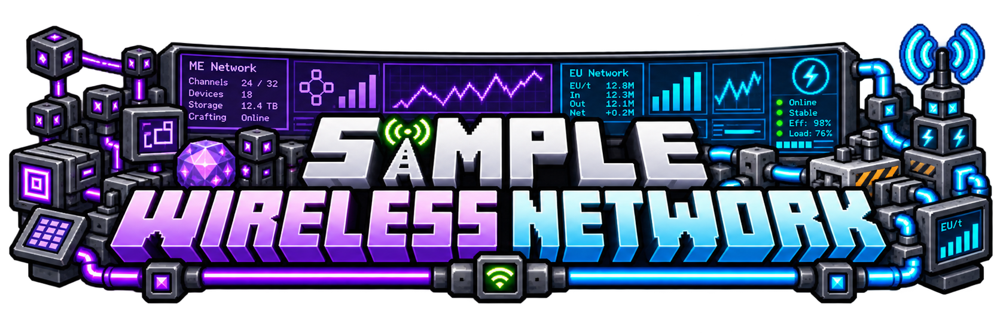

<h1 align="center">GT-Simple-Wireless-Network</h1>

<strong><em>GTNH 无线电网模组</em></strong> <strong><em>GTNH Wireless Energy Network Mod</em></strong>

  
  
  
  
  

一个 GregTech New Horizons 模组，为 GTNH 无线 EU 网络添加**无线能量监控、传输和红石控制**。提供便携式和方块式监视器、无线网络链路终端和链路终端覆盖板（能源/动力）——全部可在 LV 阶段合成——实现智能电网分析、红石逻辑输出和任意机器的无线能量传输。

A GregTech New Horizons mod that adds **wireless energy monitoring, transfer, and redstone control** to the GTNH wireless EU network. It provides portable and block-based monitors, wireless network link terminals, and link terminal covers (Energy/Power) — all craftable at LV tier — enabling intelligent grid analysis, redstone logic output, and seamless wireless energy transfer for any machine.

> \[!NOTE]
> 这是一个非官方模组，讨论此模组时请注意场合。
> This is an unofficial mod. Please avoid discussing this mod in official GTNH forums.

> 📖 **完整文档请查阅 [Wiki](https://github.com/MIAOKATZE/GT-Simple-Wireless-Network/wiki) / For full documentation, see the [Wiki](https://github.com/MIAOKATZE/GT-Simple-Wireless-Network/wiki)**

## 下载与版本需求 / Downloads & Requirements

| GTNH         | GTSWN  | 维护 / Maintenance |
| ------------ | ------ | :--------------: |
| 2.9.0 beta1-3 & RC1-2 | **1.8.0 +** （当前 / current） |        ✔️        |
| 2.9.0 beta-1&2 | 1.0.0~1.7.25| ✔️ |
| 2.8.4        | 0.2.0  |        ❌️        |

下载最新版本 / Download the latest version：[GitHub Releases](https://github.com/MIAOKATZE/GT-Simple-Wireless-Network/releases)

将发布页的生产 jar 放入客户端与服务端的 `mods/`，替换旧版，保留一个 GTSWN jar；不要安装 `-dev.jar` 或 `-sources.jar`。当前开发基线为 GTNH **2.9.0-RC-2**，旧版本兼容范围见上表。依赖 GT5U、GTNHLib、StructureLib、ModularUI、ModularUI2、AE2；NEI、Baubles、WAILA、BetterQuesting 提供额外集成。

Place the release jar in both client and server `mods/`, replacing the old version and keeping one GTSWN jar. Do not install `-dev.jar` or `-sources.jar`. The current development baseline is GTNH **2.9.0-RC-2**; see the table for older compatibility. Requires GT5U, GTNHLib, StructureLib, ModularUI, ModularUI2 and AE2; NEI, Baubles, WAILA and BetterQuesting provide extra integrations.

***

## 无线能量监视器 / Wireless Energy Monitor

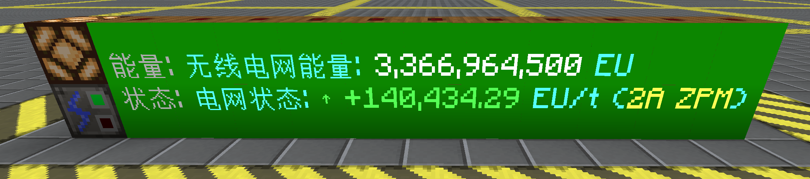 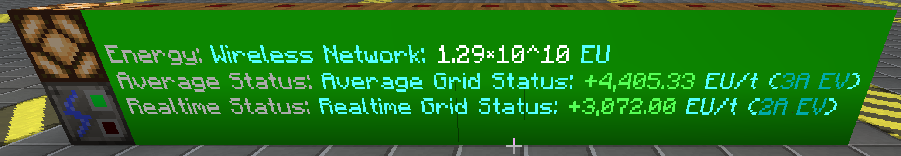 <em>无线能量监视器 / Wireless Energy Monitor</em>

**无线能量监视器 / Wireless Energy Monitor** — 单方块机器，实时显示无线电网能量状态（每五秒），具备高级红石控制（可以以电网容量或者电网状态为指标）。支持5种红石模式（关闭/高电平/低电平/正向滞后/反向滞后），参数化阈值设定，状态贴图动态切换。其还可以连接工业信息屏。

A single-block machine that displays real-time (per 5 seconds) wireless network energy status with advanced redstone control (can be measured by the wireless capacity or the wireless status). Supports 5 redstone modes (Off/High/Low/High-Hysteresis/Low-Hysteresis) with parametric threshold settings. Dynamic texture switching reflects redstone output state. It can also be connected to the Industrial Information Panel.

- **显示模式 / Display Modes**: 常规计数 / 科学计数（Normal counting (1,234,567 EU) / Scientific notation (1.235×10^6 EU)）
- **智能 EU/t / Smart EU/t**: 实时变化率，GT 风格安培数 + 电压等级显示（如 "2A HV"）/ Real-time change rate with GT-style amperage + voltage tier display (e.g., "2A HV")

 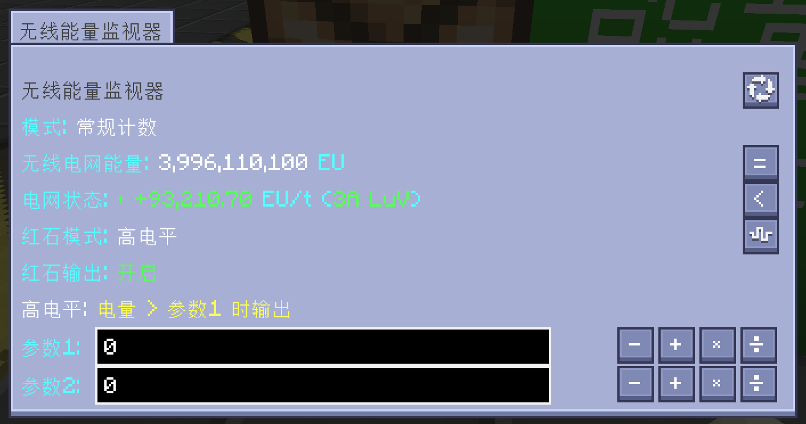 <em>中文界面 (up) & English interface (down)</em>

***

## 便携无线监测终端 / Portable Wireless Network Monitor

放在背包或任意 Baubles 饰品栏即可显示电网 HUD，无需放置方块。首次右击绑定玩家，之后右击切换关闭/常规/科学计数；Shift+右击重新绑定。

Carry it in inventory or any Baubles slot for a wireless grid HUD, without placing blocks. First right-click binds it to you; further right-clicks cycle Off/Normal/Scientific. Sneak-right-click rebinds it.

- **安装与换电池 / Install or replace**：终端 + 兼容 GT/IC2 电池无序合成，继承新电池电量；旧电池带着终端剩余电量返还，背包满则掉落。仍是同一个终端 / Shapeless-craft terminal + compatible GT/IC2 battery. The new battery retains its charge; the old one returns with the terminal’s remaining energy, dropping if inventory is full. No separate terminal variants.
- **充电 / Charging**：在背包或饰品栏中，每 10 秒从已绑定的无线电网补满缓存并计算下行损耗，以电池电压级的每目标 1A 为背包、装备和饰品栏电力物品充电。HUD 显示缺少缓存/待机中/充电中/充电完毕 / In inventory or Baubles, refills from the bound grid every 10 seconds with downlink loss, and charges inventory, armor and accessory items at 1A per target for the battery tier. HUD states: buffer empty / standby / charging / complete.
- **拆卸与查看 / Remove and inspect**：带电池终端 + GT5U 撬棍无序合成，可取回保留余量的电池；NEI 提供小型锂电池安装与拆卸两条示例。电量使用 GT/IC2 原生 Tooltip 与电量条显示；充电更新避免打断手持工具操作 / Shapeless-craft a battery-equipped terminal + GT5U crowbar to recover the charged battery. NEI shows two small lithium battery examples: installation and removal. Native GT/IC2 energy tooltips and charge bars show the buffer; charge updates preserve held-tool use.

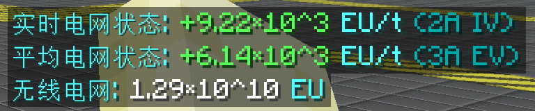 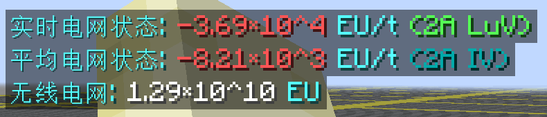 <em>科学计数模式 — 充电状态 (left) & 放电状态 (right)</em>

***

## 网络信息屏与拓展屏 / Network Info Panel & Extender

网络信息屏与拓展屏拼成连续矩形大屏，显示无线电网能量趋势。支持 5 分钟、1 小时、8 小时、24 小时、7 天、1 月、3 月、1 年八个时间窗口；同一玩家的多块 EU 信息屏共享历史数据。

**Network Info Panel** and extenders form a continuous rectangular screen showing wireless energy trends. Eight time windows cover 5m/1h/8h/24h/7d/1M/3M/1Y; EU panels belonging to the same player share history.

  <em>网络全天候检测示意图 / Network All-Weather Monitoring</em>

- **多方块屏幕 / Multi-block Screen**: 主屏 + 拓展屏构成连续填充矩形；拓展屏自动附着到相邻主屏 / Main panel + extender panels form a contiguous filled rectangle; extender screens automatically attach to adjacent main screens

- **玩家共享 / Per-Player Sharing**: 数据集绑定玩家 UUID；多块屏幕显示同一数据 / Datasets bound to player UUID; multiple screens display the same data
- **外观 / Appearance**：可配置背景、线色、线宽、曲线平滑度与字号 / Configure background, line colors, thickness, smoothing and text size.
- **显示模式 / Display Modes**: 常规计数 (1,234,567) / 科学计数 (1.23E6) / 公制计数 (1.23K)，**默认科学计数** / Normal counting (1,234,567) / Scientific notation (1.23E6) / Metric notation (1.23K), **scientific by default**

### AE 走势图 / AE Chart

手持物品或流体右键信息屏，绑定 AE 网络中的存量与变化率。蓝色左轴显示存量，橙色右轴显示变化率；支持八个时间窗口和可缩放简报。

**AE Chart** — Right-click the panel with an item or fluid to track its AE-network stock and rate. The blue left axis shows stock, orange right axis shows rate; eight time windows and a scalable brief are available.

 <em>AE 走势图 / AE Chart</em>

- **双 Y 轴 / Dual Y-Axis**: 左轴 = 存量（蓝），右轴 = 变化率（橙，与无线电网 EU/t 线颜色一致）/ Left axis = stock (blue), right axis = change rate (orange, consistent with wireless EU network EU/t line color)
- **操作 / Controls**：`+/-` 调整简报字号，时长按钮切换时间窗口 / Use `+/-` to resize the brief and the time-span button to switch windows.
- **简报 / Brief**：显示当前存量、实时变化率与平均变化率 / Shows stock, realtime rate and average rate.
- **可配置 / Configurable**: Y 轴上下限、线宽、样条平滑度、背景色、线色、线条可见性开关 / Y-axis min/max, line thickness, spline smoothing, background color, line color, line visibility toggles

### AE 实时监测 / AE Realtime Monitor

AE 实时监测，同时监控多个 AE 物品/流体，可滚动列表显示。每行包含图标、名称、存量、实时变化率、300s 平均变化率。支持格子模式与可配置字号/加粗/图标大小。手持物品/流体右键信息屏即可添加监视项。

**AE Realtime Monitor** — Monitor multiple AE items/fluids simultaneously in a scrollable list. Each row shows icon, name, stock, realtime change rate, and 300s average change rate. Supports grid mode and configurable font size/bold/icon size. Right-click the panel with an item/fluid in hand to add a monitored item.

 <em>AE 实时监测 / AE Realtime Monitor</em>

- **列表 / List**：支持滚轮、拖拽和滚动条 / Supports mouse wheel, dragging and scrollbar.

- **格子模式 / Grid Mode**: 紧凑格子布局备选，单元格大小可配置 / Alternative compact grid layout with configurable cell size
- **在线状态 / Online Status**: 深绿色文字表示该 AE 物品在线并被监视 / Deep green text indicates the AE item is online and being monitored

***

## 红石控制系统 / Redstone Control System

无线能量监视器具备5模式红石控制系统：

The Wireless Energy Monitor features a 5-mode redstone control system:

| 模式   | 行为                 |
| ---- | ------------------ |
| 关闭   | 不输出红石信号            |
| 高电平  | 电量 > 阈值时输出信号       |
| 低电平  | 电量 < 阈值时输出信号       |
| 正向滞后 | >参数1时输出，必须<参数2才能取消 |
| 反向滞后 | <参数2时输出，必须>参数1才能取消 |

| Mode            | Behavior                                              |
| --------------- | ----------------------------------------------------- |
| Off             | No redstone output                                    |
| High            | Output signal when EU > threshold                     |
| Low             | Output signal when EU < threshold                     |
| High-Hysteresis | Output when EU > param1, cancel only when EU < param2 |
| Low-Hysteresis  | Output when EU < param2, cancel only when EU > param1 |

***

## 电网读数 / Grid Readings

监视器与便携终端显示电网储量、瞬时变化率和窗口平均变化率。默认平均窗口为 300 秒；接近零时显示 `<1EU`、静默或长期静默。它反映电网净变化，不代表单台机器的功率。

Monitors and portable terminals show grid energy, instantaneous rate and window-average rate (300 seconds by default). Near-zero readings display `<1EU`, Silent or Long-Term Silent. These describe net grid change, rather than an individual machine’s power.

***

## 无线网络链路终端与覆盖板 / Wireless Energy Tap & Covers

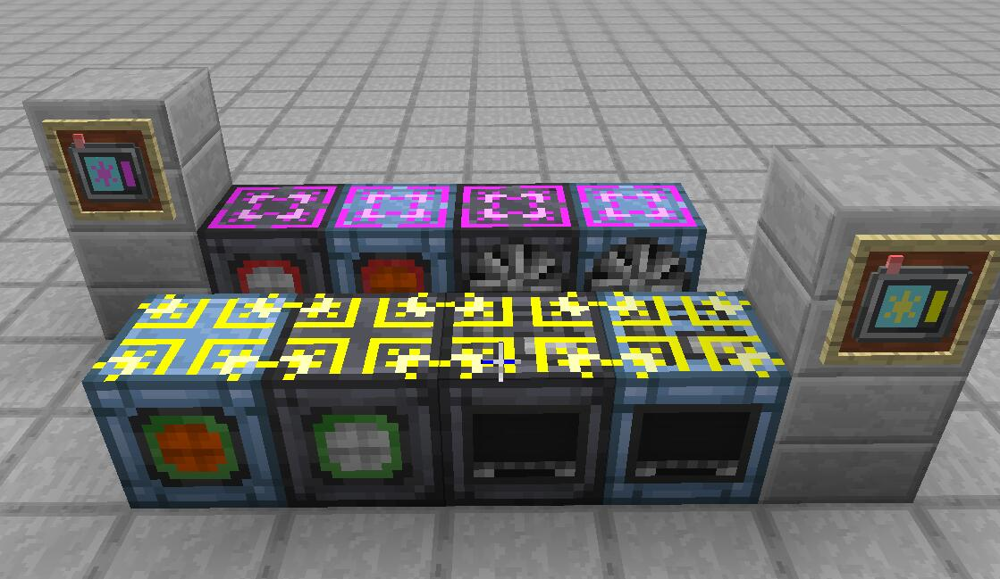 <em>链路终端与覆盖板 / Energy Tap and Covers</em>

### 无线网络链路终端 / Wireless Energy Tap

便携物品，将任意机器连接到跨维度共享的无线 EU 网络，链路节点支持跨维度供电与回传。Shift+右键切换能源模式（从电网获取，可配置损耗，默认15%）和动力模式（向电网输出，通过电容量缓冲池像虚拟导线般取电）。动态纹理反映当前模式。绑定激光源仓/靶仓时需消耗 1 根激光真空管。

A portable item that connects any machine to the wireless EU network shared across dimensions. Link nodes support cross-dimension energy delivery and return. Shift+right-click to switch between Energy mode (draw from network, configurable loss, default 15%) and Power mode (output to network, virtual-cable drain via capacity buffer). Dynamic texture reflects current mode. Binding a Laser Source/Target Hatch consumes 1 Laser Vacuum Pipe.

- **显形 / Reveal**：手持终端 Alt+右键，穿墙显示附近链路节点 60 秒，聊天框报告数量 / Alt+right-click reveals nearby link nodes through walls for 60 seconds and reports the count.
- **九宫格辅助线 / Grid Highlight**: 指向 GT 机器（ICoverable）时，绘制与 GT 扳手/覆盖板工具一致的九宫格辅助线——能源模式=黄色线，动力模式=紫色线。/ When pointing at a GT machine (ICoverable), draws a 3×3 grid highlight matching GT wrench/cover tool behavior — Energy mode = yellow lines, Power mode = purple lines.

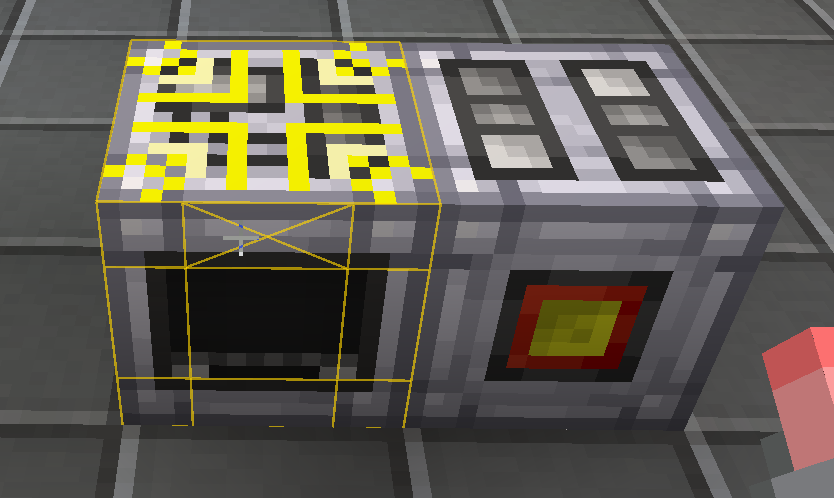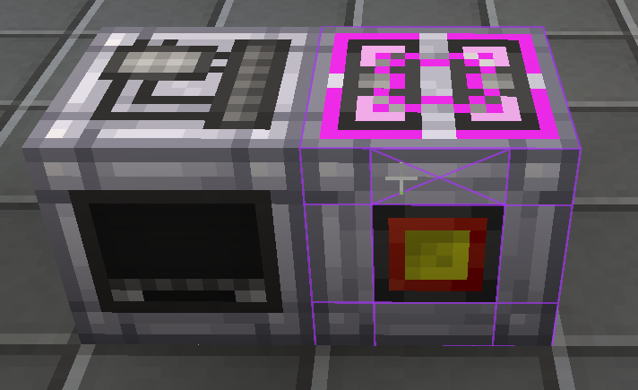 <em>九宫格辅助线 / Grid Highlight</em>

### 链路节点 / Link Nodes

右击机器自动安装对应覆盖板，无需单独合成。裸覆盖板没有配置不能工作；机器仍需保持区块加载。能源模式持续从缓存向机器供电，动力模式收集发电机输出并回传电网，覆盖板所在面不再向真实导线重复输出。

Right-click a machine to install the appropriate cover; no separate recipe is needed. Bare covers without configuration do not work, and machine chunks must remain loaded. Energy mode powers the machine from its buffer; Power mode collects generator output and returns it to the grid, blocking duplicate cable output on the covered face.

- **损耗与周期 / Loss and interval**：默认每 600 tick（30 秒）与电网交互，下行损耗 15%、上行 0%；可在 `gtswn_network.cfg` 配置。拆除覆盖板时剩余缓存按上行损耗返还 / Grid interaction defaults to every 600 ticks (30 seconds), with 15% downlink loss and 0% uplink loss. Configure these in `gtswn_network.cfg`; removing a cover returns its remaining buffer with uplink loss.
- **拆机 / Dismantling**：扳手左键配合 Shift 拆除全部覆盖板；配合 Alt 静默清除链路节点，其他覆盖板保持原行为。链路节点不掉落物品，剩余电量回到电网 / Wrench-left-click with Shift removes all covers; with Alt silently clears link nodes while other covers retain their usual behavior. Link nodes leave no item drops and return their remaining energy to the grid.
- **配置复制 / Copying settings**：`AllowCopyPasteTool` 默认关闭；开启后 GT 覆盖板工具、物质操纵者等可复制节点配置 / `AllowCopyPasteTool` is off by default; enable it to copy node settings with GT cover tools or MatterManipulator.

***

## ME 网络量子终端与节点 / ME Network Quantum Terminal & Node

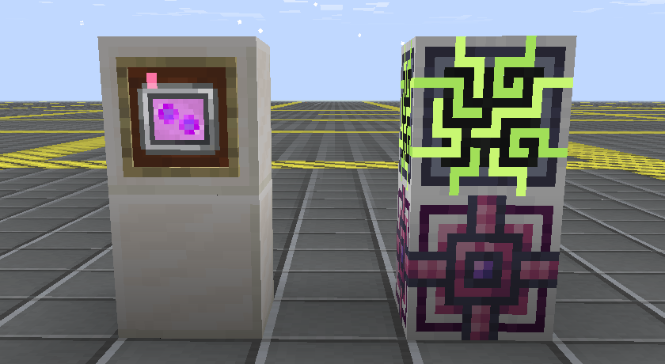 <em>ME 网络量子终端 / ME Network Quantum Terminal</em>

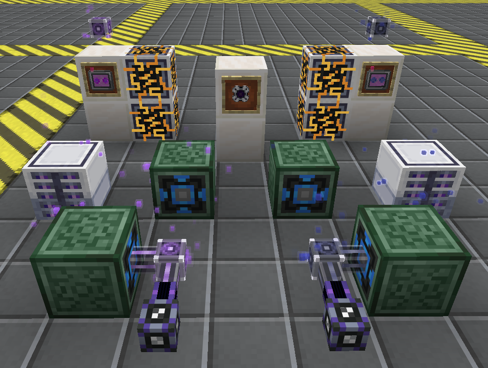 <em>量子节点与量子并入：多网络调色展示 / Quantum Nodes and incorporation: multiple network colors</em>

为 AE2 网络提供「量子化」远程接入机制。量子终端将成型的 ME 控制器整结构量子化并绑定其网络；量子节点作为远程接入点，经虚拟桥接接入锚点控制器网络——突破原版线缆距离限制，相邻 AE2 设备直接入网。

The Quantum Terminal binds a formed ME controller structure. Quantum Nodes connect distant AE2 devices to that network, bypassing cable distance limits.

量子终端可通过 LV 级工作台配方合成（福鲁伊克斯方块 ×4 + LV 发射器 ×4 + ME 控制器 ×1）；量子节点无独立配方——已绑定终端右击空地放置，Shift+右击销毁（无掉落）。

Quantum Terminal is craftable via an LV-tier crafting recipe (Fluix ×4 + LV Emitter ×4 + ME Controller ×1); the Quantum Node has no recipe — place it with a bound terminal by right-clicking ground, and destroy it with shift+right-click (no drops).

### 量子终端 / Quantum Terminal

| 手势 / Gesture | 行为 / Behavior |
|---|---|
| 右击控制器 / Right-click controller | 量子化并绑定整结构（已量子化则改绑）/ Quantize & bind the entire structure (rebinds if already quantized) |
| Shift+右击控制器 / Shift+right-click controller | 取消量子化并解绑 / Dequantize & unbind |
| 右击空地（已绑定）/ Right-click ground (bound) | 放置量子节点 / Place a Quantum Node |
| Shift+右击节点 / Shift+right-click node | 销毁节点（无掉落）/ Destroy the node (no drops) |
| Shift+右击空气 / Shift+right-click air | 打开终端界面 / Open terminal GUI |
| Alt+右击完整 AE 方块 / Alt+right-click a full AE block | 消耗一个量子并入锚点接入已绑定网络；再次操作解除并入 / Consume one Quantum Incorporation Anchor to join the bound network; repeat to remove incorporation |
| Alt+对空气长按右键 1 秒 / Hold Alt+right-click air for 1 second | 显形附近已加载区块中的当前网络 15 秒；同一终端、维度与网络在显形期间再次操作可显形附近全部量子网络 / Reveal the current network in nearby loaded chunks for 15 seconds; repeat during the reveal with the same terminal, dimension and network to reveal all nearby quantum networks |

终端界面提供 16 色调色，颜色在同一量子网络内同步。终端物品仅中心粒子变色，节点、连接边缘、并入粒子与显形框随网络颜色变化；按 `E`（背包键）或 `Esc` 关闭界面。

The terminal GUI offers 16 network colors, synchronized across the quantum network. Only the terminal item's center particles change color; nodes, connection rims, incorporation particles and reveal outlines follow the network color. Press `E` (inventory key) or `Esc` to close.

### 量子节点 / Quantum Node

- **远程桥接 / Remote Bridge**: 经虚拟桥接接入锚点控制器 ME 网络，相邻 AE2 设备直接入网。/ Bridges into the anchored controller's ME grid via a virtual connection; adjacent AE2 devices join the network directly.
- **连接容量 / Connection Capacity**: 使用致密线缆容量（**32 频道/连接**），节点本身不消耗频道。/ Uses DENSE cable capacity (**32 channels/connection**); the node itself does not consume channels.
- **待机功耗 / Idle Power**: 通过 `quantumNodeIdlePowerUsage` 配置（默认实际扣除 10.0 AE/t）。/ Configurable via `quantumNodeIdlePowerUsage` (default actual draw: 10.0 AE/t).
- **跨维度 / Cross-Dimension**: 量子节点支持跨维度桥接；锚点维度与区块必须已加载，节点不会主动加载锚点。/ Quantum Nodes support cross-dimension bridging; the anchor dimension and chunk must already be loaded. Nodes do not load the anchor themselves.

### 量子并入与锚点 / Quantum Incorporation & Anchor

已绑定的量子终端可将完整 AE 方块和支持 ME 网络的 GT 仓室直接并入网络。每次成功并入消耗一个**量子并入锚点**，再次 Alt+右击解除并入；AE 线缆、总线等部件及控制器不适用。设备保留原方块、功能与库存。

A bound Quantum Terminal can incorporate full AE blocks and ME-capable GT hatches directly into its network. Each successful incorporation consumes one **Quantum Incorporation Anchor**; Alt+right-click again to remove it. AE cable/bus parts and controllers are excluded. Devices keep their original block, functions and inventory.

- **合成 / Crafting**：LV 组装机每批产出 16 个锚点：基础涂层电路板 ×1、LV 发射器 ×1、LV 传感器 ×1、钢板 ×2、末影珍珠 ×1、细铜线 ×4。/ An LV assembler produces 16 anchors per batch from Basic Coated Circuit Board ×1, LV Emitter ×1, LV Sensor ×1, Steel Plate ×2, Ender Pearl ×1 and Fine Copper Wire ×4.
- **隔离与强化 / Isolation & Protection**：并入设备阻断物理 AE 连接，避免相邻网络串网，并获得挖掘与爆炸防护；先解除并入再拆除。/ Incorporated devices block physical AE connections to prevent adjacent networks from merging, and resist mining and explosions. Remove incorporation before dismantling.
- **额外耗电 / Additional Power**：每个有效并入连接默认额外实际扣除 **50 AE/t**，由 `config/gtswn/gtswn_ae.cfg` 的 `quantumIncorporationIdlePowerUsage` 配置，重启应用。这 50 AE/t 不含设备原生功耗与频道耗电，两者仍由 AE 独立计算；解除并入、连接失效或区块卸载后释放附加功耗。缺电不会免除耗电需求。/ Each valid incorporation connection adds an actual **50 AE/t** by default, configured by `quantumIncorporationIdlePowerUsage` in `config/gtswn/gtswn_ae.cfg` and applied after restart. This excludes native device and channel power, which AE calculates independently. Removing incorporation, invalidating the connection or unloading the chunk releases the surcharge. An unpowered grid retains the demand.

节点与并入附加费抵消 AE 配置的耗电倍率，实际分别扣除 10 和额外 50 AE/t；原设备及频道的原生倍率计费保持不变。/ The node draw and incorporation surcharge compensate for AE's configured power multiplier, drawing 10 and an additional 50 AE/t respectively. Native device and channel power still use AE's normal multiplier.

### 过载保护 / Overload Protection

量子节点带入的频道超过控制器容量时，启动 **3 分钟宽限倒计时**；期间频道恢复即取消，否则到期后控制器结构会 **爆炸**。达到 95% 容量时聊天警告。AE2 开启无限频道时无此限制。

Exceeding controller channel capacity starts a **3-minute grace countdown**. Restoring capacity cancels it; otherwise the controller structure **explodes** at expiry. A chat warning appears at 95% capacity. This limit does not apply with AE2 infinite channels enabled.

### 量子化控制器强化 / Hardened Controller

量子化控制器难以挖掘且有防爆强化；用终端 Shift+右击取消量子化后再拆除。

Quantized controllers resist mining and explosions. Sneak-right-click with the terminal to dequantize before dismantling.

***

## 设备信息终端 / Device Info Terminal

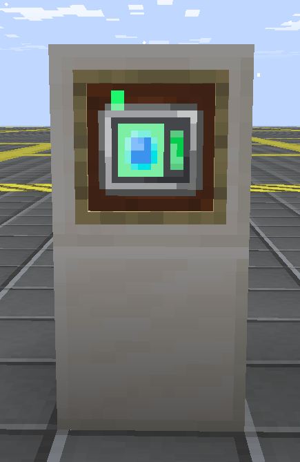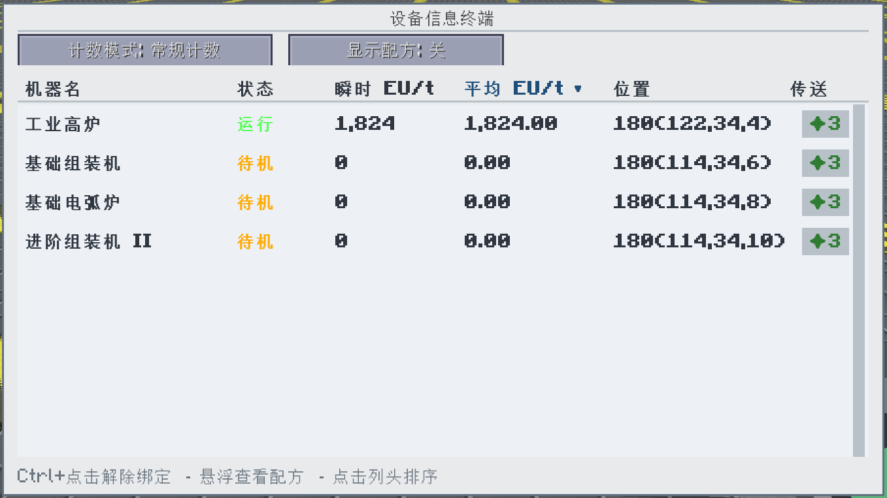 <em>设备信息终端物品（左）与界面（右） / Device Info Terminal item (left) & GUI (right)</em>

绑定可工作 GT 机器，在列表中查看运行/待机/停机、瞬时与平均 EU/t、位置及当前配方。支持排序、四种计数法、消耗经验的传送与远程解绑。

Bind working GT machines to view Running/Idle/Stopped status, instantaneous and average EU/t, location and current recipe. Supports sorting, four number formats, XP-cost teleport and remote unbinding.

| 手势 / Gesture | 行为 / Behavior |
|---|---|
| 右击可工作机器 / Right-click a working machine | 绑定到本终端（放置机器时背包含终端自动绑定 / auto-bound on placement if a terminal is in the placer's inventory） |
| 右击空气 / Right-click air | 打开终端界面 / Open the terminal GUI |
| Shift+右击（机器/空气）/ Shift+right-click (machine or air) | 扫描当前维度已加载区块中的本人及团队机器，5 秒倒计时可取消 / Scan your and your team’s machines in loaded chunks of the current dimension; cancellable 5-second countdown |
| Ctrl+点击条目 / Ctrl+click a row | 远程解绑（无确认）/ Remote unbind (no confirmation) |
| 点击行内 ✦ 按钮 / Click the ✦ button on a row | 传送到机器（消耗经验等级，3 秒冷却）/ Teleport to the machine (costs XP levels, 3s cooldown) |

- **采样与均值 / Sampling & Averages**: 每 `deviceSampleIntervalSeconds`（默认 10 秒）采样一次；平均列为 60 点滚动均值，瞬时 EU/t 取最新采样点。/ Machines are sampled every `deviceSampleIntervalSeconds` (default 10s); the average column is a 60-point rolling mean, instant EU/t is the latest sample.
- **配方 / Recipe**：悬浮机器名称查看当前配方；“显示配方”开关可直接在列表展示 / Hover a machine name for its current recipe; the Show Recipe toggle displays it in the list.

- **发电与耗电 / Generation and consumption**：支持常见 GTNH 发电机的实时功率，耗电读数带负号；聚变控制器按自身消耗计入耗电，等离子产物的发电由下游机器统计 / Supports realtime power from common GTNH generators; consumption is negative. Fusion controllers count their own consumption, while energy from plasma products is measured at downstream generators.

- **配置 / Configuration**：默认每 10 秒采样，绑定上限 1024 台，传送花费 3 级经验；均可在配置文件调整 / Defaults: sample every 10 seconds, bind up to 1024 machines, teleport for 3 XP levels. All are configurable.
- **合成 / Crafting**: LV 级有序配方（v1.7.8 起）：LV 传感器 ×2 + LV 发射器 ×2 + 钢板 ×3 + 电脑屏幕覆盖板 ×1 + 末影珍珠 ×1 → 设备信息终端 ×1。/ LV-tier shaped recipe (since v1.7.8): LV Sensor ×2 + LV Emitter ×2 + Steel Plate ×3 + Computer Screen Cover ×1 + Ender Pearl ×1 → Device Info Terminal ×1.

***

## BQ 任务包 / BetterQuesting Quest Pack

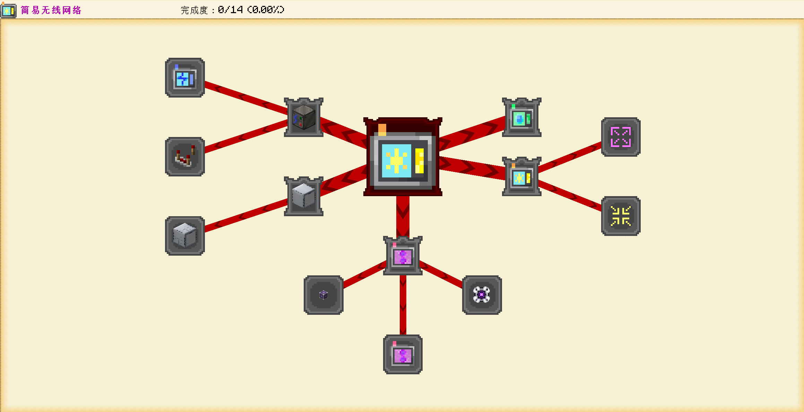 <em>「简易无线网络」任务线总览（14 题，红连线分支树） / "GT Simple Wireless Network" quest line (14 quests)</em>

随模组内置 **简易无线网络（GT Simple Wireless Network）** 任务线：14 个任务从无线能量监视器与掌上 HUD 讲起，经链路终端与无线覆盖板、墙面信息屏，一直到 ME 网络量子化、量子并入锚点与网络调色，以及设备信息终端——全部为 LV 时代科技。任务线与各任务的名称、描述均内置中英双语本地化。

A BetterQuesting quest pack ships inside the mod: the **GT Simple Wireless Network (简易无线网络)** quest line of 14 quests — from the Wireless Energy Monitor and pocket HUD through the Link Terminal and its covers and wall-sized info panels, ending with ME network quantization, Quantum Incorporation Anchors and network colors, and the Device Info Terminal. Everything is LV-era tech. Quest line and per-quest names/descriptions are localized in both Chinese and English.

- **更新 / Updates**：任务线自动装载；换新版 jar 后老世界同步任务定义并保留进度 / The quest line loads automatically; replacing the jar updates existing worlds’ definitions while keeping progress.

***

## 管理员命令 / Admin Commands

需要 OP 等级 4。/ OP level 4 required.

- **`/gtswn global_energy_trans <fromUUID> <toUUID>`** — 一次性将 fromUUID 网络的所有 EU 迁移到 toUUID 网络。用于玩家换账户（正版转第三方等）导致 UUID 变化后迁移 EU。/ One-time transfer of all EU from one UUID's network to another. Use when a player's UUID changes (e.g., premium → third-party account).

- **`/gtswn global_energy_join <memberUUID> <leaderUUID>`** — 将成员的无线 EU 网络永久并入队长网络 / Permanently join the member’s wireless EU network to the leader’s.

- **`/gtswn cleanup_info_data <all|player>`** — 清理过期信息屏历史，或指定在线玩家的全部历史 / Clean expired panel history, or all history for a selected online player.

***

## 客户端命令 / Client Commands

无需 OP 或作弊，仅作用于本地客户端，支持 Tab 补全。/ No OP or cheats required; client-side only, with Tab completion.

- **`/gtswn HudXOffset [值]`** / **`/gtswn HudYOffset [值]`** — 调整便携监测终端 HUD 的水平/垂直偏移（整数，±500；Y 正值向上）。/ Adjust the portable monitor HUD horizontal/vertical offset (integer, ±500; positive Y is up).
- **`/gtswn HudScale [值]`** — 调整便携监测终端 HUD 缩放（0.2–5.0）。/ Adjust the portable monitor HUD scale (0.2–5.0).
- **`/gtswn hud <charge|eu|instant|average> <on|off>`** — 分别开关充电、电量、瞬时与平均功率行 / Toggle the charge, energy, instantaneous and average power rows.
- **`/gtswn quality <low|medium|high>`** — 调整客户端量子粒子密度：low 关闭、medium 减半、high 默认，保存至配置项 `QuantumParticleQuality`。/ Set client quantum particle density: low off, medium half, high default; saved as `QuantumParticleQuality`.
- 带参数时立即生效并保存到 `config/gtswn/gtswn_network.cfg`；偏移/缩放命令无参数时显示当前值，四行开关也可在 `[hud]` 配置 / Values apply immediately and save to `config/gtswn/gtswn_network.cfg`. Offset/scale commands without values show current settings; row toggles are also configurable in `[hud]`.

***

## 许可证 / License

AGPL-3.0，详见 LICENSE 文件。
AGPL-3.0 — see the LICENSE file.
